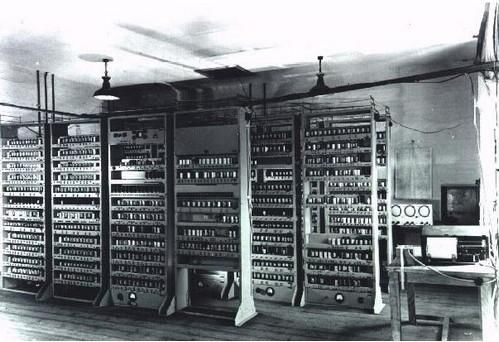
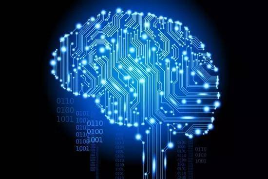
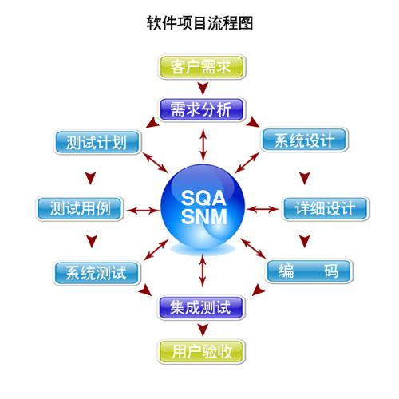
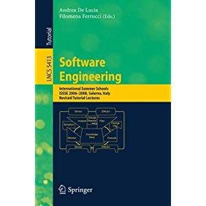
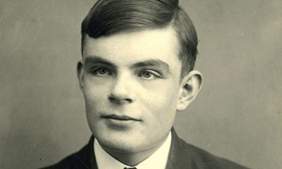
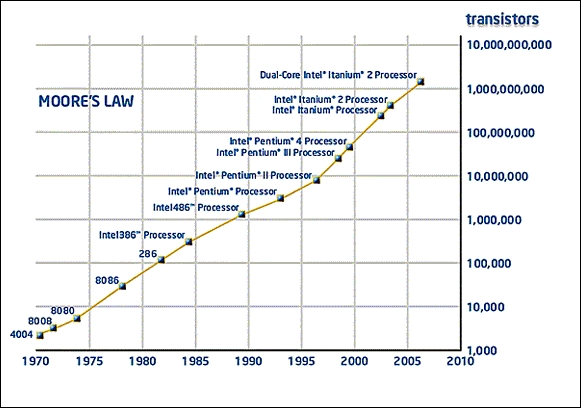

# Explain Words

 # 1. Computer：    
   A computer is a device that can be instructed to carry out sequences of arithmetic or logical operations automatically via computer programming.  
   计算机是一种可以通过计算机编程自动执行算术或逻辑运算序列的设备。

   
***
***

# 2.	Computer science：
Computer science is the study of the theory, experimentation, and engineering that form the basis for the design and use of computers.   
计算机科学是对理论、实验和工程的研究，构成了计算机设计和使用的基础。

   

***
***

#3.	Software:  
 Computer software, or simply software, is a generic term that refers to a collection of data or computer instructions that tell the computer how to work, in contrast to the physical hardware from which the system is built, that actually performs the work.   
 计算机软件，或者简称软件，是一个通用术语，指的是一组数据或计算机指令，告诉计算机如何工作，与系统构建的物理硬件相比，它实际上是执行工作的。

***
***
#4.	Software engineering:  
 Software engineering is the application of engineering to the development of software in a systematic method  
 软件工程是将工程应用于软件开发的系统方法

***
***
# 5.	Alan Turing: 
Alan Mathison Turing OBE FRS (/ˈtjʊərɪŋ/; 23 June 1912 – 7 June 1954) was an English computer scientist, mathematician, logician, cryptanalyst, philosopher, and theoretical biologist.[2] Turing was highly influential in the development of theoretical computer science, providing a formalisation of the concepts of algorithm and computation with the Turing machine, which can be considered a model of a general purpose computer.[7][8][9] Turing is widely considered to be the father of theoretical computer science and artificial intelligence.[10] However, he was also a tragic figure: a hero who was never fully recognized in his home country during his lifetime due to his homosexuality, which was then a crime in the UK.   
Alan Mathison Turing OBE FRS（/tjr/;1912年6月23日——1954年6月7日）是一位英国计算机科学家、数学家、逻辑学家、密码分析师、哲学家和理论生物学家。图灵在理论计算机科学的发展中具有很高的影响力，它提供了算法和计算概念的形式化，图灵机可以被认为是通用计算机的模型。图灵被广泛认为是理论计算机科学和人工智能之父。然而，他也是一个悲剧人物：在他的祖国，由于他的同性恋身份，他在自己的国家里从未得到充分的认可，而这在英国是一种犯罪。

***
***
# 6.	Moore’s law:
 Moore's law is the observation that the number of transistors in a dense integrated circuit doubles about every two years  
 摩尔定律是一种观察，即在密集集成电路中，晶体管的数量每两年就会翻一番。

***
***
