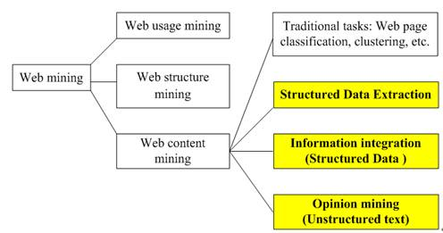

# 进制转换  

① 1分12秒 = （72000 ）毫秒  
② （7A）13 = （ 101）10  
③ （7A）16 = （122 ）10   
④ （7A）16 = （1111010 ）2 = （ 172）8  
⑤ （1011011）2 = （ 133）8  = （5B ）16  
⑥ （678）10 = （ 10000100110）2 = （ 2046）8  
⑦ （111）2 + （101）2 = （1100 ）2  

***
***  

# wikipedia search  

# 1)Information：  

 Information is any entity or form that provides the answer to a question of some kind or resolves uncertainty.  
信息是任何实体或形式提供了某种问题的答案或解决了不确定性

  

***
***  

# 2)Positional notation ：  

Positional notation or place-value notation is a method of representing or encoding numbers.  
位置表示法或位置值表示法是表示或编码数字的一种方法。

  

***
***  

# 3)Algorithm：  

In mathematics and computer science, an algorithm (/ˈælɡərɪðəm/ ( listen)) is an unambiguous specification of how to solve a class of problems.  
在数学和计算机科学中，一个算法（/lrm/（听））是一个明确的关于如何解决一类问题的规范。

  

***
***  

# 4)Software bug：  

A software bug is an error, flaw, failure or fault in a computer program or system that causes it to produce an incorrect or unexpected result, or to behave in unintended ways.  
 软件缺陷是计算机程序或系统中的错误、缺陷、故障或故障，导致它产生不正确或意外的结果，或者以非预期的方式表现。
  

***
***  

# Translation  

1)十进制 
    decimal  
2)二进制 
    binary  
3)八进制 
    octal  
4)十六进制
    hexadecimal
