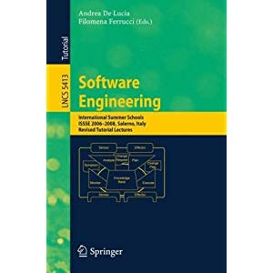

# 1.Write out variables  x, y and z in binary code 
Question:
1) int8_t x = 67;  int8_t y = -7;   int8_t z = y - x; 
2) int8_t x = 0xd3; 
3) uint8_t = 0xd3; 
4) int8_t x = 127;  int8_t y = -7;   int8_t z = y – x;
5) float x = 1.125; 
6) float x = 23.0; 
7) float x = 0.45;  
上述代码中，哪些出现溢出错误，哪些出现精度误差。
***
Answer：  
@ x  ,y  , z    
1.00110111,  11111001,  10110110  
2.overfloat   
3.11010011  
4.01111111,  11111001,  overfloat  
5.1.001  
6.10111.0  
7.0.01110001100011...精度误差
***
***
# 使用维基百科，解释以下概念  
 1)Method of complements
 

In mathematics and computing, the method of complements is a technique used to subtract one number from another using only addition of positive numbers. This method was commonly used in mechanical calculators and is still used in modern computers. 
The nines' complement of a number is formed by replacing each digit with nine minus that digit. To subtract a decimal number y (the subtrahend) from another number x (the minuend) two methods may be used: 
In the first method the nines' complement of x is added to y. Then the nines' complement of the result obtained is formed to produce the desired result. 
In the second method the nines' complement of y is added to x and one is added to the sum. The leading digit '1' of the result is then discarded. Discarding the initial '1' is especially convenient on calculators or computers that use a fixed number of digits: there is nowhere for it to go so it is simply lost during the calculation. The nines' complement plus one is known as the ten's complement. 
The method of complements can be extended to other number bases (radices); in particular, it is used on most digital computers to perform subtraction, represent negative numbers in base 2 or binary arithmetic and test underflow and overflow in calculation. [1] 在数学和计算中，互补的方法是一种技术，用来从另一个数字中减去一个数字，只使用正数。这种方法在机械计算器中普遍使用，至今仍在现代计算机中使用。
nines的补数是通过用9减去这个数字来替换每个数字的。要从另一个数字x（分钟）中减去一个十进制数字y（subtrahend），可以使用两种方法：
在第一个方法中，nines的x的补体被加到y中，然后得到的结果的补体是为了产生想要的结果而形成的。
在第二种方法中，nines的y的补体被加到x中，一个加到求和中。结果的前导数字“1”被丢弃。丢弃最初的“1”在计算器或使用固定数字数字的计算机上特别方便：没有任何地方可以使用，所以在计算过程中它就会丢失。nines的补体加1被称为10的补体。
补充的方法可以扩展到其他的数字基础（radices）;特别地，它被用于大多数数字计算机执行减法，在基础2或二进制算术中表示负数，并在计算中进行溢出和溢出。[1]

Contents

 ***

 2)Byte  
 The byte is a unit of digital information that most commonly consists of eight bits, representing a binary number.   
 字节是一个数字信息的单位，它通常由8位组成，代表一个二进制数。

 ***
   
 3)Integer (computer science)Jump to search
In computer science, an integer is a datum of integral data type, a data type that represents some range of mathematical integers.   
在计算机科学中跳转到搜索，整数是积分数据类型的数据，这是一种表示某些数学整数范围的数据类型。

 ***
  
 4)Floating point  
 In computing, floating-point arithmetic (FP) is arithmetic using formulaic representation of real numbers as an approximation so as to support a trade-off
 在计算中，浮点算术（FP）是用公式化的实数表示来进行算术运算来支持权衡

 ***
 ***
 # Prove
 1)请证明：二进制的负数（two‘s complement of X）等于 X 的 ones’ complement  ＋ 1（即，X每位求反加1）  
 证：   
   设x<0,a= |x|, b为所求。  
   因为a+b=2k  
   所以b=（2k  -1-a）+1
   2k  -1-a即为a的补码

 ***   
 2)Int8_t x = - 017; 请用8进制描述变量 x。在c中017即(017)8  
  x=(361)8
***

# 阅读维基百科” Two‘s complement”的内容，特别是Sign extension小节内容。 
Two's complement is a mathematical operation on binary numbers, best known for its role in computing as a method of signed number representation. For this reason, it is the most important example of a radix complement. 
The two's complement of an N-bit number is defined as its complement with respect to 2N. For instance, for the three-bit number 010, the two's complement is 110, because 010 + 110 = 1000.   
二的补体是对二进制数的数学运算，最出名的是它在计算中的作用，它是一种符号数字表示方法。由于这个原因，它是基数补码的最重要的例子。
两个n位数字的补码被定义为它对2N的补充。例如，对于3位数字010，两者的补数是110，因为010+110=1000。
***
***
# 1)C程序：
int8_t  x = -0x1f;  int y = x;  请用16进制描述变量 x 和 y，并说明 int y = x 的计算过程。
x=(e1)16 ? ?  ? what is y ? ? ?

2)请用数学证明，为什么可以这么计算。  
  What should I do  ?  Who can tell me ？
***
***
# 阅读维基百科” Floating point”的内容， 
In computing, floating-point arithmetic (FP) is arithmetic using formulaic representation of real numbers as an approximation so as to support a trade-off between range and precision  
在计算中，浮点运算（FP）是用公式化的实数表示来进行算术运算，以支持在范围和精度之间进行权衡。  
1)   NaN 是什么？   
What ？？？  
What is 'NAN' ???

***

