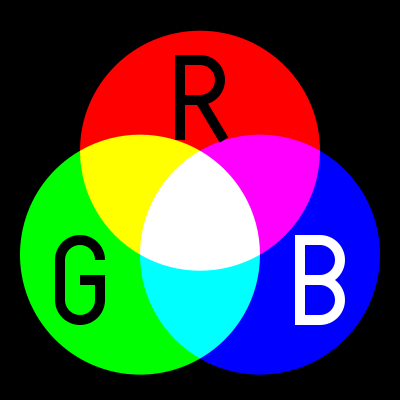
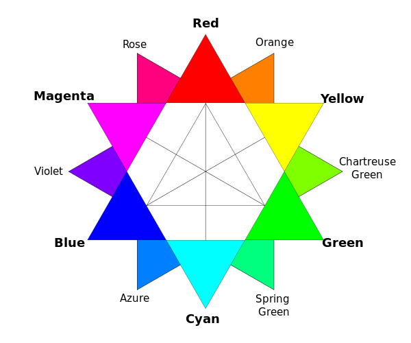
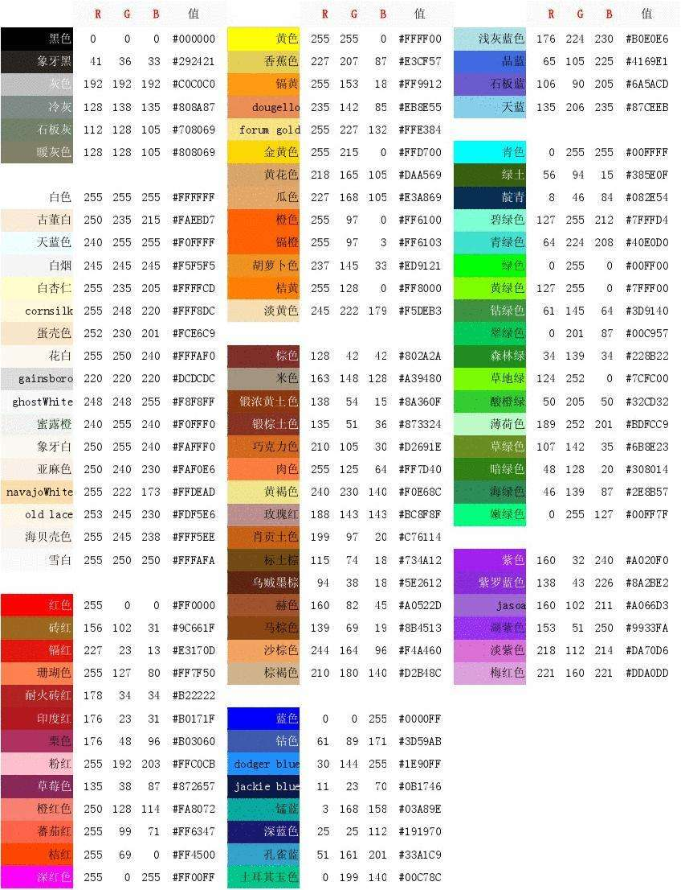

# 一、维基百科
1)ASCII       
ASCII (/ˈæskiː/ ( listen) ASS-kee),[1]:6 abbreviated from American Standard Code for Information Interchange, is a character encoding standard for electronic communication.  
ASCII（/ski/（听）ASS-kee），1:6，缩写为美国标准代码交换，是电子通信的字符编码标准  

2）color  

Color (American English) or colour (Commonwealth English) is the characteristic of human visual perception described through color categories, with names such as red, orange, yellow, green, blue, or purple.   
颜色（美式英语）或颜色（英联邦英语）是通过颜色分类描述的人类视觉感知的特征，如红色、橙色、黄色、绿色、蓝色或紫色  

***
***
# Two、Else question
1) 写出字符“A”,“中”的ASCII 码、Unicode 码、 utf-8 编码  
 ascii: 0x41   
 unicode: 0x0041   
 utf-8: 0x41  
 @注： http://wenku.baidu.com/view/f4c225340b4c2e3f572763da.html 
中: 没有ascii码，只有ansi字符流 0xd6 0xd0
unicode: 0x4e2d
utf-8: 0xe4 0xb8 0xad   
# fron 中山大学软件工程11届校友百度解答
***
2)黄色(yellow)的RGB编码是(255 ,255 ,0 ) 

***
3) 从网上下载一个 BMP 格式图像,用图片编辑工具另存在 jpg、 png、tiff 格式。问三种格式中,哪种格式显示质量好?相对于 BMP 格式,压缩率各是多少?   
A:  
4) Winrar压缩文件是lossless, or lossy 方法？  
A: