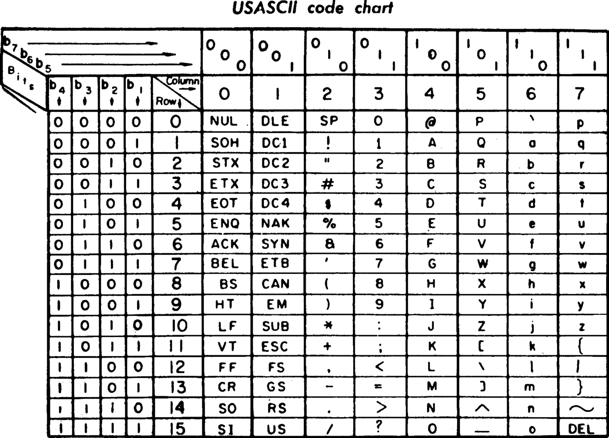

# 一、维基百科  

1)ASCII  

ASCII (/ˈæskiː/ ( listen) ASS-kee),[1]:6 abbreviated from American Standard Code for Information Interchange, is a character encoding standard for electronic communication.  
ASCII（/ski/（听）ASS-kee），1:6，缩写为美国标准代码交换，是电子通信的字符编码标准  
   

***
***
***  

2）color   

  
Color (American English) or colour (Commonwealth English) is the characteristic of human visual perception described through color categories, with names such as red, orange, yellow, green, blue, or purple.   
颜色（美式英语）或颜色（英联邦英语）是通过颜色分类描述的人类视觉感知的特征，如红色、橙色、黄色、绿色、蓝色或紫色  

   

***
***   

# Two、Else question  

1) 写出字符“A”,“中”的ASCII 码、Unicode 码、 utf-8 编码    

 ascii: 0x41   
 unicode: 0x0041   
 utf-8: 0x41  
 @注： http://wenku.baidu.com/view/f4c225340b4c2e3f572763da.html 
中: 没有ascii码，只有ansi字符流 0xd6 0xd0
unicode: 0x4e2d
utf-8: 0xe4 0xb8 0xad  

# fron 中山大学软件工程11届校友百度解答   

***  

2)黄色(yellow)的RGB编码是(255 ,255 ,0 )  

  

***   
***  

3) 从网上下载一个 BMP 格式图像,用图片编辑工具另存在 jpg、 png、tiff 格式。问三种格式中,哪种格式显示质量好?相对于 BMP 格式,压缩率各是多少?   

Answer:   
jpg 3.5%  

png 18%  

tiff 不确定

## 相关：  
1.JPG(有损压缩)格式是最常用的图像文件格式，由一个软件开发联合会组织制定，是一种有损压缩格式，能够将图像压缩在很小的储存空间，图像中重复或不重要的资料会被丢失，因此容易造成图像数据的损伤。尤其是使用过高的压缩比例，将使最终解压缩后恢复的图像质量明显降低， JPEG格式压缩的主要是高频信息，对色彩的信息保留较好，适合应用于互联网，可减少图像的传输时间，可以支持24bit真彩色，也普遍应用于需要连续色调的图像。  

2.GIF （无损压缩）是用于压缩具有单调颜色和清晰细节的图像（如线状图、徽标或带文字的插图）的标准格式。
 GIF分为静态GIF和动画GIF两种，支持透明背景图像，适用于多种操作系统，“体型”很小，网上很多小动画都是GIF格式。其实GIF是将多幅图像保存为一个图像文件，从而形成动画,所以归根到底GIF仍然是图片文件格式。但GIF只能显示256色   

 3.PNG（无损压缩）是20世纪90年代中期开始开发的图像文件存储格式，其目的是企图替代GIF和TIFF文件格式，同时增加一些GIF文件格式所不具备的特性。流式网络图形格式(Portable Network Graphic Format，PNG)名称来源于非官方的“PNG's Not GIF”，是一种位图文件(bitmap file)存储格式，读成“ping”  

 4.BMP（无压无损） 是一种与硬件设备无关的图像文件格式，使用非常广。它采用位映射存储格式，除了图像深度可选以外，不采用其他任何压缩，因此，BMP文件所占用的空间很大。BMP文件的图像深度可选lbit、4bit、8bit及24bit。BMP文件存储数据时，图像的扫描方式是按从左到右、从下到上的顺序。 
  由于BMP文件格式是Windows环境中交换与图有关的数据的一种标准，因此在Windows环境中运行的图形图像软件都支持BMP图像格式。。PNG用来存储灰度图像时，灰度图像的深度可多到16位，存储彩色图像时，彩色图像的深度可多到48位，并且还可存储多到16位的α通道数据。PNG使用从LZ77派生的无损数据压缩算法。  

  5.tiff(灵活，可压可不):  TIFF是一种比较灵活的图像格式，它的全称是Tagged Image File Format，文件扩展名为TIF或TIFF。该格式支持256色、24位真彩色、32位色、48位色等多种色彩位，同时支持RGB、CMYK以及YCbCr等多种色彩模式，支持多平台。TIFF文件可以是不压缩的，文件体积较大，也可以是压缩的，支持RAW、RLE、LZW、JPEG、 CCITT3组和4组等多种压缩方式。   
 

***
***  

4) Winrar（用于管理压缩包文件的共享软件）压缩文件是lossless（无损）, or lossy（有损） 方法？  
  
Answer:  
winrar是无损压缩，lossless