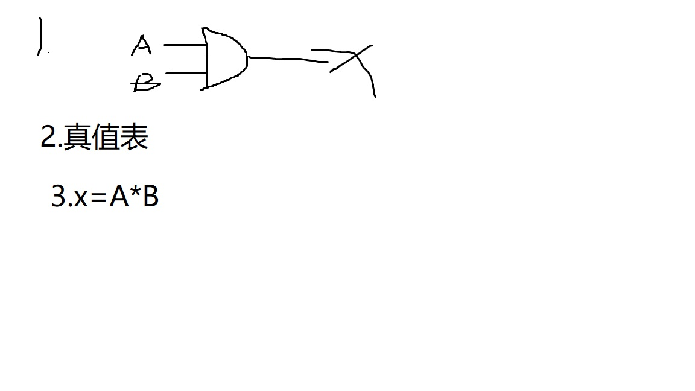
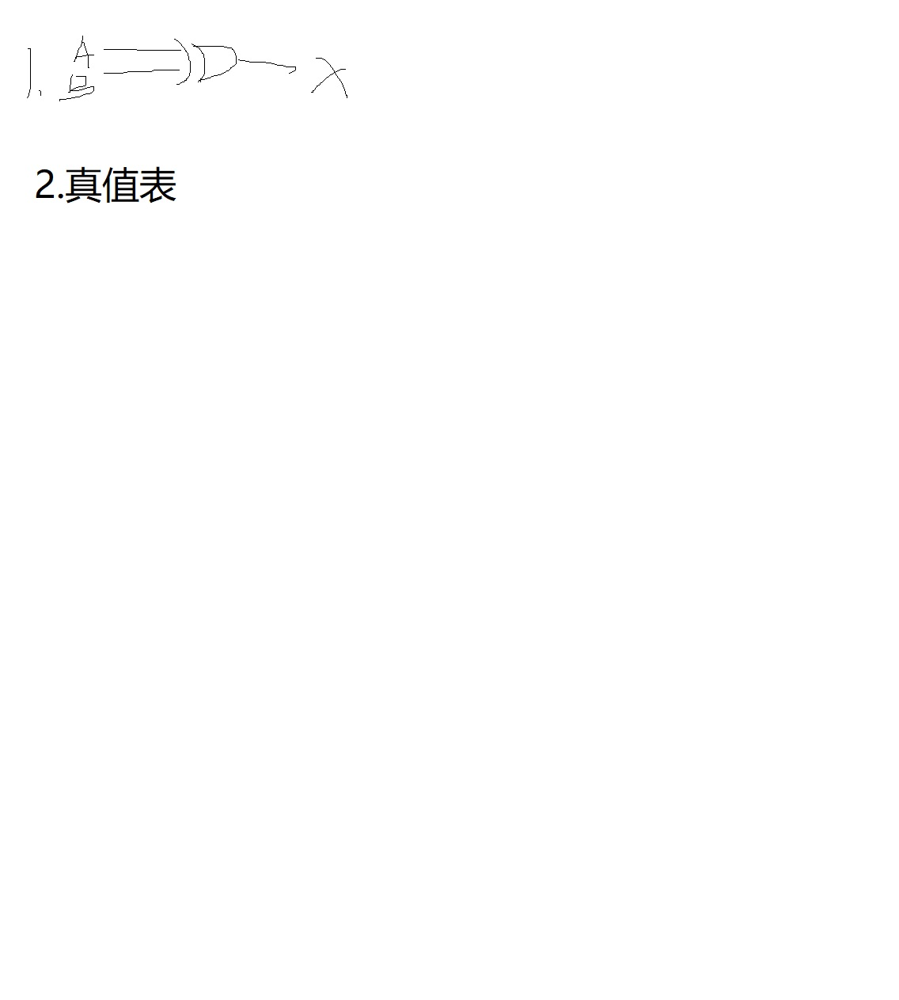
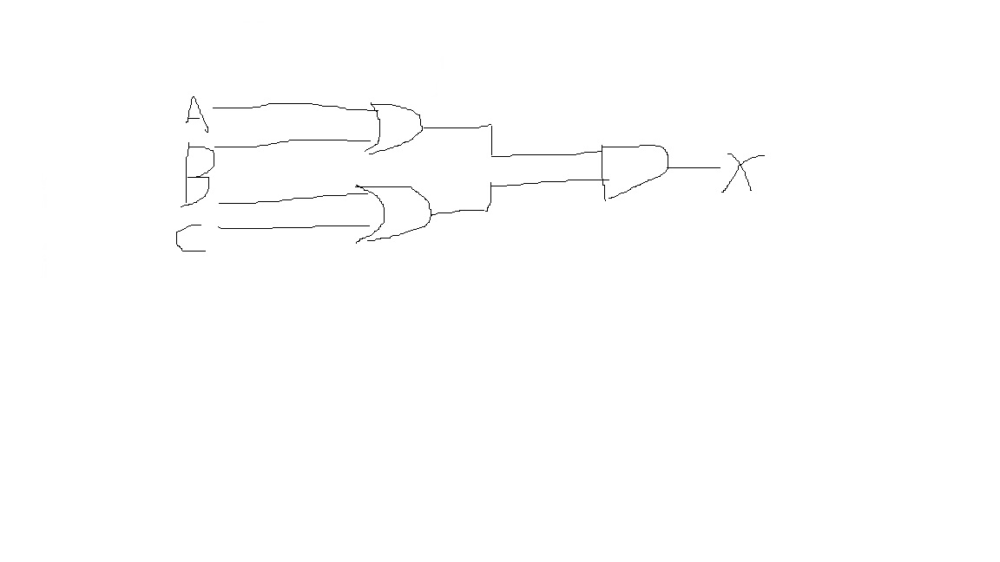
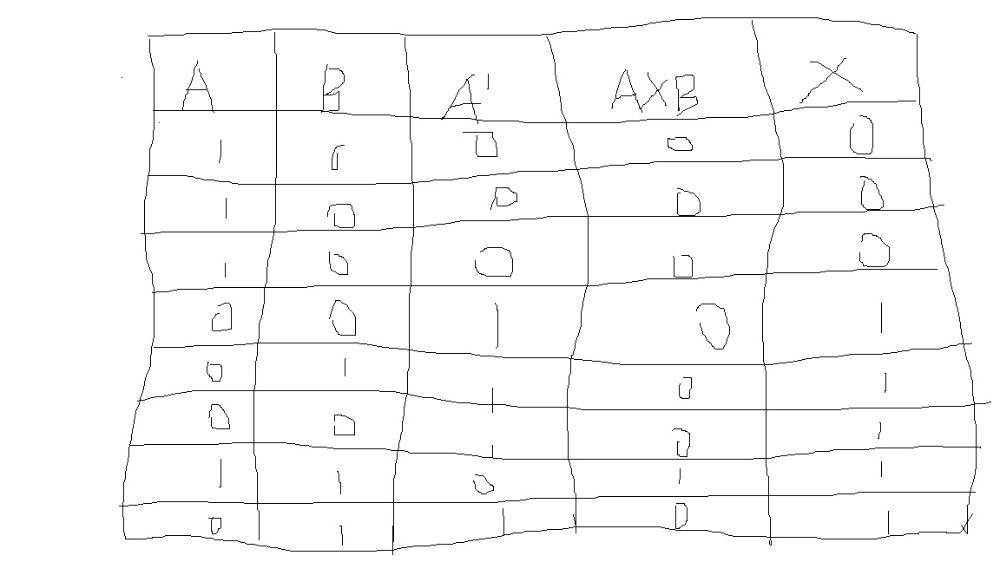
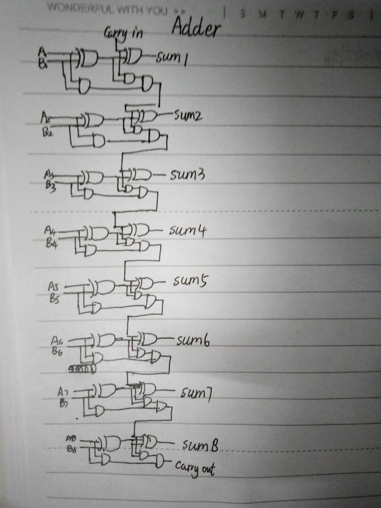

1) Give the three representations of an AND gate and say in your words what AND means. (给出与门的三个表征，用你的语言说出什么和意味着什么。)     
answer:  
  
## &nbsp;&nbsp;&nbsp;&nbsp;&nbsp;&nbsp;&nbsp;&nbsp;&nbsp;&nbsp;&nbsp;&nbsp;&nbsp;&nbsp;&nbsp;&nbsp;&nbsp;&nbsp;&nbsp;&nbsp;&nbsp;&nbsp;&nbsp;&nbsp;&nbsp;&nbsp;&nbsp;&nbsp;&nbsp;&nbsp;&nbsp;&nbsp;&nbsp;&nbsp;全真为真，有假为假

 2) Give the three representations of an XOR gate and say in your words what XOR means. (给出XOR门的三种表示形式，用你的话解释XOR是什么意思。)    
&nbsp;answer:   
bsp;## 3.A &oplus; B  

   
 ## &nbsp;&nbsp;&nbsp;&nbsp;&nbsp;&nbsp;&nbsp;&nbsp;&nbsp;&nbsp;&nbsp;&nbsp;&nbsp;&nbsp;&nbsp;&nbsp;&nbsp;&nbsp;&nbsp;&nbsp;&nbsp;&nbsp;&nbsp;&nbsp;&nbsp;&nbsp;不同为真，相同为假

  3) Draw a circuit diagram corresponding to the following Boolean expression: (A + B)(B + C)  (绘制如下布尔表达式对应的电路图:(a + B)(B + C)   )  
  answer:  
  

  4) Show the behavior of the following circuit with a truth table:  (用真值表表示以下电路的行为:)    
 ## &nbsp;&nbsp;&nbsp;&nbsp;&nbsp;&nbsp;&nbsp;&nbsp;&nbsp;&nbsp;&nbsp;&nbsp;&nbsp;&nbsp;&nbsp;&nbsp;&nbsp;&nbsp;&nbsp;&nbsp;&nbsp;&nbsp;&nbsp;&nbsp;&nbsp;&nbsp;&nbsp;&nbsp;&nbsp;&nbsp;&nbsp;&nbsp;&nbsp; A' &oplus;( A &times;B)
 
  

5) What is circuit equivalence? Use truth table to prove the following formula. (AB)’ = A’ + B’  （什么是电路等效性?用真值表来证明下面的公式。(AB) ' = A ' + B '）

|A|B|A'|B'|(AB)'|A'+B'|  
|-|-|-|-|-|-|  
|1|0|0|1|1|1|  
|0|0|1|1|1|1|  
|1|1|0|0|0|0|  
|0|1|1|0|1|1|  
|1|1|0|0|0|0|  
|1|0|0|1|1|1|  
|0|0|1|1|1|1|  
|0|1|1|0|1|1|    

6) There are eight 1bit full adder integrated circuits. Combine them to 8bit adder circuit using the following box diagram.  （有8个1位全加法器集成电路。使用下面的框图将它们组合到8位加法器电路中。）    
## &nbsp;&nbsp;&nbsp;&nbsp;&nbsp;&nbsp;&nbsp;&nbsp;&nbsp;&nbsp;&nbsp;&nbsp;&nbsp;&nbsp;&nbsp;&nbsp;&nbsp;&nbsp;&nbsp;&nbsp;&nbsp;&nbsp;&nbsp;&nbsp;&nbsp;&nbsp;&nbsp;&nbsp;&nbsp;&nbsp;&nbsp;&nbsp;&nbsp;&nbsp;&nbsp;纯手绘
  

7) Logical binary operations can be used to modify bit pattern. Such as (X8X7X6X5X4X3X2X1)2 and (00001111)2= (0000X4X3X2X1)2 We called that (00001111)2 is a mask which only makes low 4 bits to work. Fill the follow expression（逻辑二进制操作可以用来修改位模式。例如(X8X7X6X5X4X3X2X1)2和(00001111)2= (0000X4X3X2X1)2我们称之为(00001111)2是一个面具，它只使低4位工作。填充下列表达式）
  
(1)  (X8X7X6X5X4X3X2X1)2 or (00001111)2 = (X8X7X6X5X4X3X2X1           )2   

(2)  (X8X7X6X5X4X3X2X1)2 xor (00001111)2 = (X8X7X6X50000           )2  

(3)  ((X8X7X6X5X4X3X2X1)2 and(11110000)2 ) or  (not (X8X7X6X5X4X3X2X1)2 and (00001111)2)  =  (X8X7X6X50000           )2
 