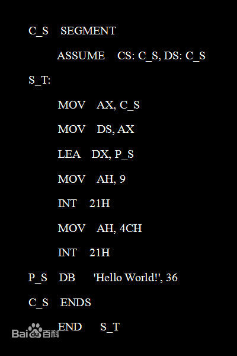
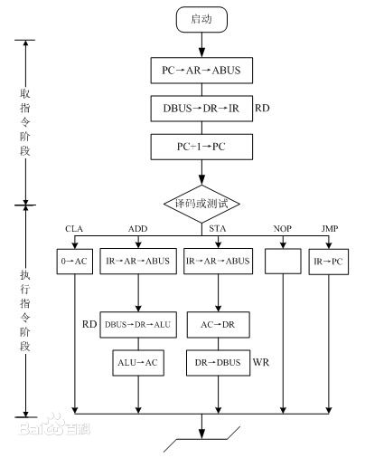
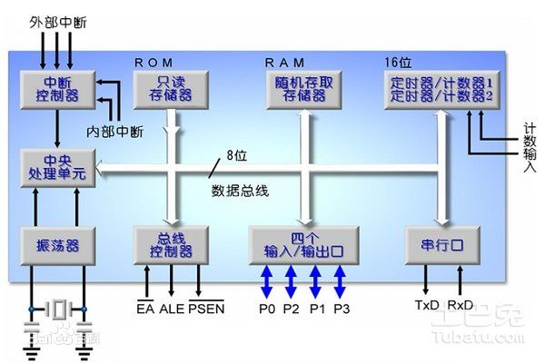
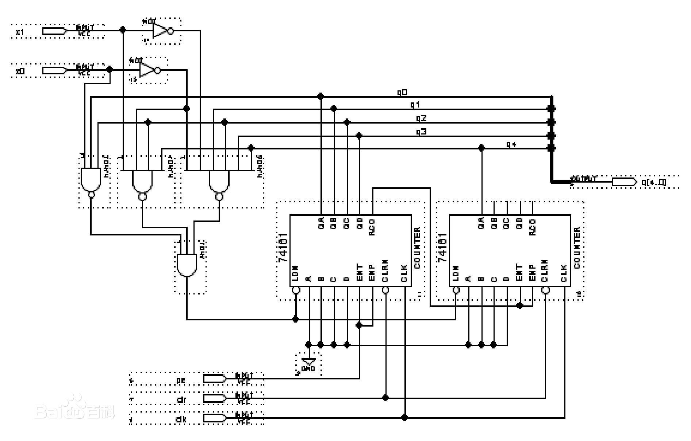
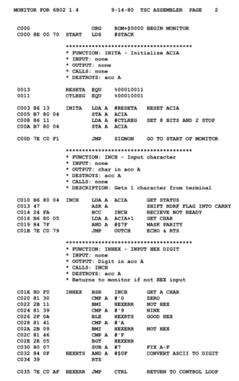
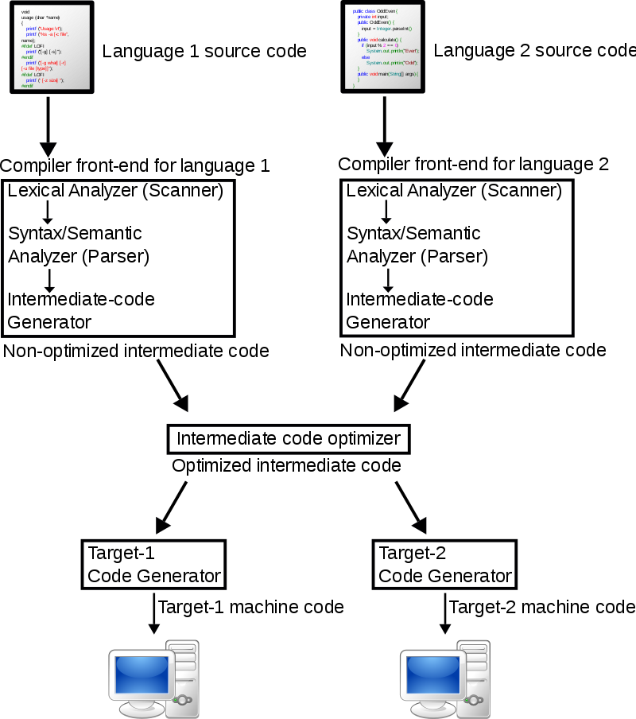

# 汇编语言与机器语言  
1、Program with machine language according to the following c.   
int_8 a = 1;  int_8 c = a + 3;   
 1）Write your assembly code & machine code   
 ## answer： 
 ### 汇编语言：  
  
 LOD a;  
 ADD #3;  
 STO c;  
 HLT     
 
 ### 机器语言  
00000000 xxxxxxxx  //取地址a  
00010002 00000011  //对3进行加法操作  
00000004 xxxxxxxx  //赋值到c的地址

 2）Explain machine code execution with the fetch-decode-execute cycle   
## answer：  
  获取第一条执行的指令，假设第一条指令中的操作码是00000000  00000110  （一般不是这个，00000000有特殊作用）,解码，即是地址还是数字，其次是确定操作，例如寻址模式是00000110，到该地址中读取数据。将这条指令运送到IR中。  

执行完这条指令后，程序计数器自动加一，读取下一条指令。
这一条指令中的00010002 00000011，解码为加法的运算，并且寻址模式是00000011代表了这个操作数的数值。 ，将3存放到运算单元中，进行加法操作后的结果保存在临时寄存器中。   

读取第三条指令，赋值给c.    

 # 3）Explain functions about  IR, PC, ACC registers in a CPU  
## IR：指令寄存器  
指令寄存器（IR，Instruction Register），是临时放置从内存里面取得的程序指令的寄存器，用于存放当前从主存储器读出的正在执行的一条指令。
当执行一条指令时，先把它从内存取到数据寄存器（DR，Data Register）中，然后再传送至IR。指令划分为操作吗和地址码，由二进制数字组成。为了执行任何给定的指令，必须对操作码进行测试，以便识别所要求的操作。指令译码器就是做这项工作的。指令寄存器中操作码字段的输出就是指令译码器的输入。操作码一经译码后，即可向操作控制器发出具体操作的特定信号。  
## 取指过程：  
取指令阶段完成的任务是将现行指令从主存中取出来并送至指令寄存器中 [2]  ，具体的操作如下
现行指令地址送至存储器地址寄存器，记作PC→MAR
向主存发送读命令，启动主存作读操作，记作1→R
将MAR（通过地址总线）所指的主存单元中的内容（指令）井数据总线读至MDR内，记作M（MAR）→MDR
将MDR的内容送至IR，记作MDR→IR
指令的操作码送至CU译码，记作OP（IR）→CU
形成下一条指令的地址，记作（PC）+1→PC  

   ##  pc:程序计数器（读取）  
    程序计数器是用于存放下一条指令所在单元的地址的地方。
当执行一条指令时，首先需要根据PC中存放的指令地址，将指令由内存取到指令寄存器中，此过程称为“取指令”。与此同时，PC中的地址或自动加1或由转移指针给出下一条指令的地址。此后经过分析指令，执行指令。完成第一条指令的执行，而后根据PC取出第二条指令的地址，如此循环，执行每一条指令。  
  

 ## ACC registers ：
ACC（Accumulator）是累加器A缩写。累加器A是一个具有特殊用途的二进制8位寄存器，专门用来存放操作数或运算结果。在CPU执行某种运算前，两个操作数中的一个通常应放在累加器A中，运算完成后累加器A中便可得到运算结果。  

  4）Explain physical meaning about vars a & c in a machine   

  
  ## answer：  
   var a : 定义一个变量 ，&a是a的地址.  
var c : 定义一个变量,&c是c的地址.  
  2、简答题   
1）What are stored in memory?   
     
## answer： 
 
内存中存储着以二进制形式(通常是2个字节)表示的数据和指令，而通过指令寄存器解码是数据还是地址，第五位1是数据，0是地址
2）Can a data or a instruction stored in the same place?   
## answer：   
不能     
3） Explain Instruction Format with example instructions.  
## answer：  
3、解释以下词汇  
1）汇编语言（Assembly Language）  
## answer：  
An assembly (or assembler) language,[1] often abbreviated asm, is any low-level programming language in which there is a very strong correspondence between the program's statements and the architecture's machine code instructions.[2]   
 汇编(或汇编)语言，[1]通常缩写为asm，是一种低级别的编程语言，在这种语言中，程序的语句和体系结构的机器码指令之间有很强的对应关系  
 
2）编译（Compiler）   
## answer：  
 compiler is computer software that primarily translates computer code from a high-level programming language to machine code to create an executable program.[  
     编译器是一种计算机软件，主要是将计算机代码从高级编程语言转换成机器代码来创建可执行程序。  
     
3）命令式语言（Imperative programming）  
## answer：  
In computer science, imperative programming is a programming paradigm that uses statements that change a program's state. In much the same way that the imperative mood in natural languages expresses commands, an imperative program consists of commands for the computer to perform. Imperative programming focuses on describing how a program operates.   
在计算机科学中，命令式编程是一种使用语句来改变程序状态的编程范式。与自然语言中命令式语气表达命令的方式基本相同，命令式程序由计算机执行的命令组成。命令式编程侧重于描述程序如何运行。  

4）函数编程语言（Functional programming）    
## answer：  
In computer science, functional programming is a programming paradigm—a style of building the structure and elements of computer programs—that treats computation as the evaluation of mathematical functions and avoids changing-state and mutable data.  
在计算机科学中，函数式编程是一种编程范式，是一种构建计算机程序结构和元素的风格，它将计算视为数学函数的评估，避免了数据的变化和变化。   

5）过程式编程（Procedural programming）  
## answer：  
Procedural programming is a programming paradigm, derived from structured programming, based upon the concept of the procedure call.  
过程编程是一种基于过程调用概念的编程范式，它是从结构化编程中派生出来的。  

