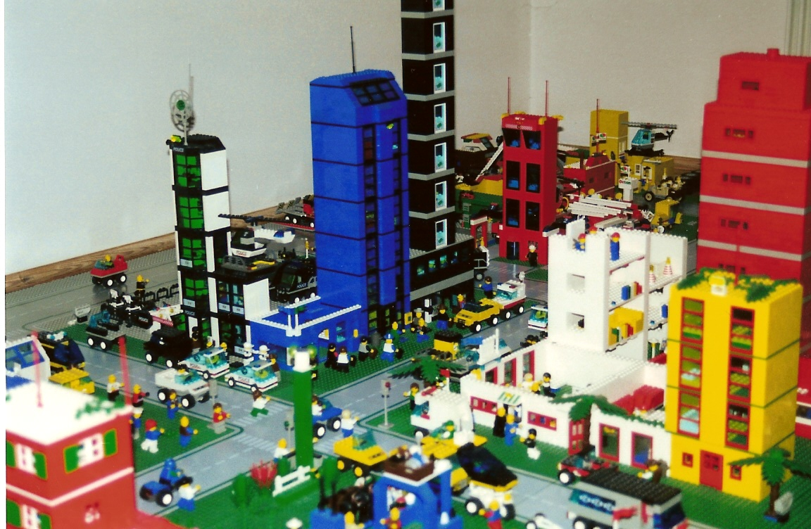
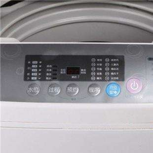

# part 1  
1、阅读 PseudocodeStandard。  （答案可以打印）  

 1）用伪代码描述将十进制转换成16进制的方法   
FUNCTION  ox (n)   
ox = n% 16  
IF n / 1 6 != 0 THEN   
ox(n/16)  
else  n%16 

condition ox==10~15:PRINTF: A, B, C, D, E, F  
OTHERS:PRINT:ox 

***
 2））C语言实现（先用注释写好算法，然后翻译）  

        /*1）用伪代码描述将十进制转换成16进制的方法   
        FUNCTION  ox (n)   
        ox = n% 16  
        IF n / 1 6 != 0 THEN   
        ox(n/16)  
        else  n%16 

        condition ox==10~15:PRINTF: A, B, C, D, E, F  
        OTHERS:PRINT:ox */

        #include <stdio.h>

        void transform(int n);

        int main(){
            int n;
            scanf("%d",&n);
            transform(n);
            return 0;
        }
        void transform(int n){
            int ox;
            
            ox=n%16;
            
            if(n>15){
                transform(n/16);
            }
            
            switch(ox){
                case 10:printf("A");break;
                case 11:printf("B");break;
                case 12:printf("C");break;
                case 13:printf("D");break;
                case 14:printf("E");break;
                case 15:printf("F");break;
                default:printf("%d",ox);
            }
        }

 
 
 ***
 3）使用 -1,  0,  1,  15,   26，3265 最为输入测试你的程序  
|十进制|十六进制|  
|-|-|    
|-1| -1|   
|0|0|  
|1|1|  
|15|F|  
|26|1A|  
|3265|CC1| 

***

2、名词解释与对比  

1） Top-down design  
Top-down and bottom-up are both strategies of information processing and knowledge ordering, used in a variety of fields including software, humanistic and scientific theories (see systemics), and management and organization.  
自顶向下和自底向上都是信息处理和知识排序的策略，用于各种领域，包括软件、人本和科学理论(参见系统学)以及管理和组织。  

***
2） Work breakdown structure (WBS)     
A work-breakdown structure (WBS)[2] in project management and systems engineering, is a deliverable-oriented breakdown of a project into smaller components.  
在项目管理和系统工程中，工作分解结构(WBS)[2]是将项目分解为更小的组件的面向交付的分解。

***
3）  简述管理学 WBS 与 信息学Top-down设计 的异同  
同：分解系统以深入了解其组成子系统breaking down of a system to gain insight into its compositional sub-systems 
异：具体的看，他们的切入点不同，Top-down由上到下，WBS根据不同类别分成小的部分  

***
3、仔细观察您洗衣机的运作过程，运用Top-down设计方法和Pseudocode 描述洗衣机控制程序。   

假设洗衣机可执行的基本操作如下：   

***
 water_in_switch(open_close)  // open 打开上水开关，close关闭   

***
 water_out_switch(open close)  // open 打开排水开关，close关闭     

***
 get_water_volume()  //返回洗衣机内部水的高度   

***
 motor_run(direction) // 电机转动。left左转，right右转，stop停  

***
 time_counter()  // 返回当前时间计数，以秒为单位   

***
 halt(returncode) //停机，success 成功 failure 失败  

***
1）请使用伪代码分解“正常洗衣”程序的大步骤。包括注水、浸泡等   
1.选择洗衣模式：对应水位，注水时间   
2.注水， 调水位   
3。浸泡  
4.电机转动, 左3次，右3次   
5.排水， 水位计计水位   
6.电机转动（脱水）  
重复4，5，6  2次   
7。end  

***
2）进一步用基本操作、控制语句（IF、FOR、WHILE等）、变量与表达式，写出每 个步骤的伪代码  
 用户选择模式  
 开始  
注水  
UNTILL 水位=注水要求  

洗涤  

for 漂洗，脱水3次
漂洗  
UNTILL 时间 = 时间要求  
WHILE(电机启动时间>0)  
 
电机左转3次  
电机右转3次  
时间-1单位  
ENDWHILE  

WHILE(水位！=0)  
排水  

ENDWHILE  
FOR（脱水时间>0）   
电机转动  
ENDFOR  

关闭电源

***
3）根据你的实践，请分析“正常洗衣”与“快速洗衣”在用户目标和程序上的异同。 你认为是否存在改进（创新）空间，简单说明你的改进意见？ 

1) 快速洗衣没有浸泡过程 ，用于男生，衣服较多  

2) 改进：加大快速洗衣时的电机转动强度，保证快洗质量 

3) 改进：自动检验漂洗情况，可以减少漂洗次数，节约用水 

***
4）通过步骤3），提取一些共性功能模块（函数），简化“正常洗衣”程序，使程序 变得更利于人类理解和修改维护。例如： wait(time) //等待指定的时间； 注水(volume,timeout) //在指定时间内完成注水，否则停机； 排水(timeout)。等子程序  
洗衣模式（S+,S,S-）   
电机转动速率（S+,S,S-）   
脱水时间（S+,S,S-）  

***
