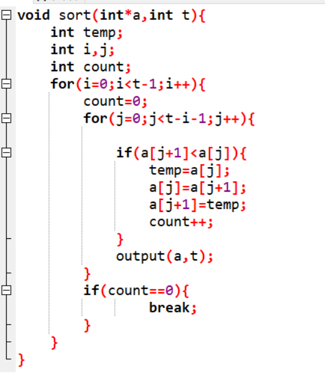

# 数组与链表  
## 1. Bubble Sort the list: 33, 56, 17, 8, 95, 22。Make sure the final result is from small to large. Write out the list after the 2nd pass. (10 points)   
{冒泡排序列表:33、56、17、8、95、22确保最终结果从小到大。在第二次考试后写出这个表。(10分)}   

    33 56 17 8 95 22  
    33 17 56 8 95 22  
    33 17 8 56 95 22  
    33 17 8 56 95 22  
    33 17 8 56 22 95  
    17 33 8 56 22 95  
    17 8 33 56 22 95  
    17 8 33 56 22 95  
    17 8 33 22 56 95  
    8 17 33 22 56 95  
    8 17 33 22 56 95   
    8 17 22 33 56 95  
    8 17 22 33 56 95  
    8 17 22 33 56 95  

## 2. Give a sorted array as list={60,65,75,80,90,95}. Design an algorithm to insert the value of x into the sorted array. Then test the algorithm with value 50,67,99.  
{给出一个排序数组list={60,65,75,80,90,95}。设计一种将x值插入排序数组的算法。然后对算法进行50、67、99的测试。}    

 思考：为什么选择插入点在list头上、中间、尾巴上的三个数作为算 法测试的数据，你能解释吗？  

 思考答案：插在头上是检验插在最左边有没有出错，插在尾巴上是检验插在最右边有没有出错，插在中间是检验插在两个数的之间有没有出错。  
 一般这三个数不出错的话，程序基本上不会出错。  

## 3. What is the state of the stack after the following sequence of Push and Pop operations? Push “anne”; Push “get”; Push “your” ; Pop; Push “my” Push “gun”   
