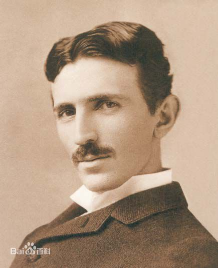
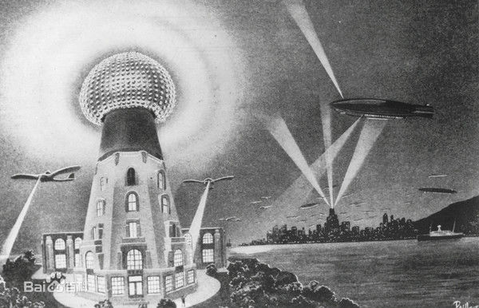
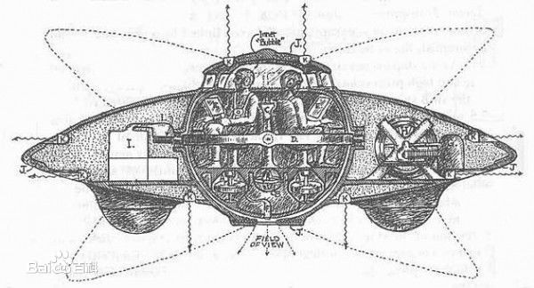
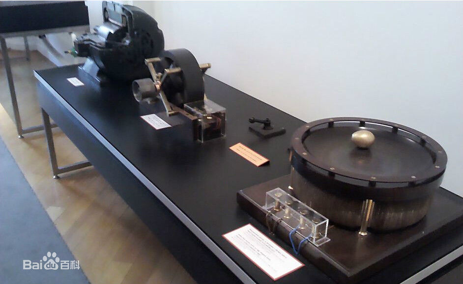
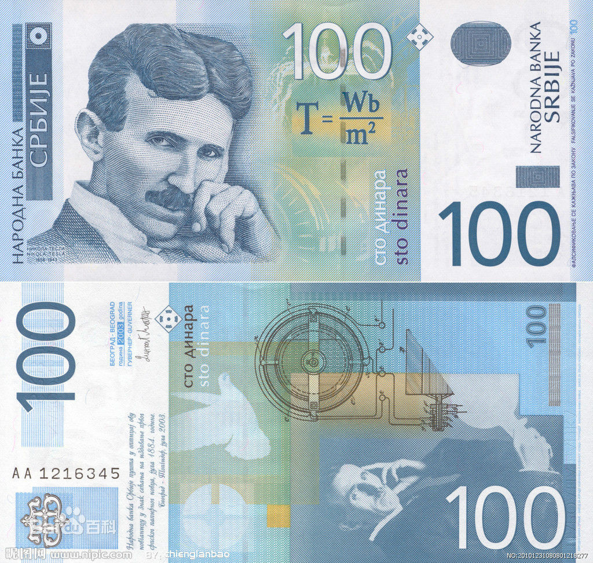

# 伟大的科学家——尼古拉*特斯拉
———我最崇拜的大咖
## 唯一堪比达芬奇并超越爱因斯坦的人，却是一个被埋没的天才！
## 他被誉为史上最伟大的科学家、最接近神的人，现在，却很少有人知道他的事迹！
## 现在请让我向大家介绍伟大的尼古拉特斯拉吧！！！
***
***
### 尼古拉特斯拉被西方科学界的精英人物誉为唯一堪比达芬奇并超越爱因斯坦的伟大科学家，是人类有史以来伟大的天才、发明创造的巨匠。  
  
 ### 但由于他身上同时也具有某种神秘甚至超自然的特质,也有人称他为神秘怪客或超人。  
  
 ### 他发明创造了交流电系统，对现代世界工业产生了深远影响。  他在科学和工程学领域取得了1000多项发明。  
 
 ### 他的很多研究项目，因为远远超于时代，技术条件远远无法跟上，而难以在他的有生之年完成。迄今为止，全世界的发明体系仍然建立于特斯拉的遗产之上，是他发明了现代世界。  
   
 ### 然而，因为历史上一些利益集团的阴谋，他的成就与事迹被认为的打压或隐瞒 ，以至绝大多数普通人连他的名字都没有听说过。  

 ### 但随着人类对环境的破坏的加大二引发的对清洁资源与自由资源的渴求，特斯拉的名字又再次浮出水面。  

