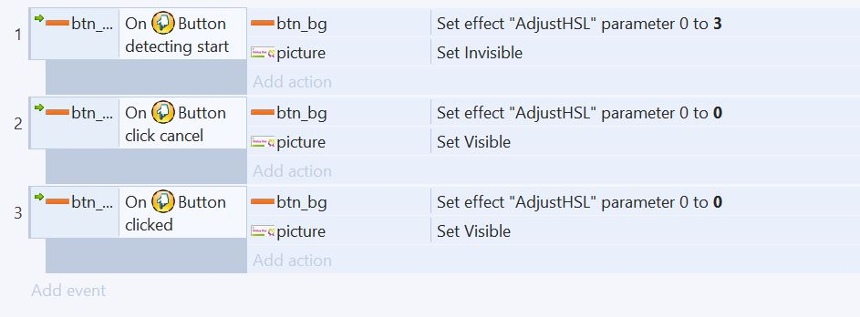
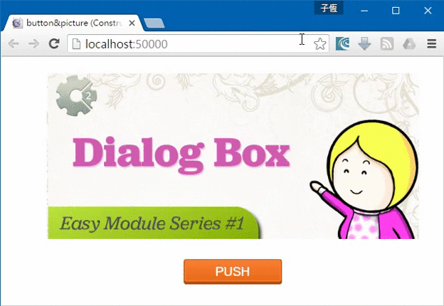
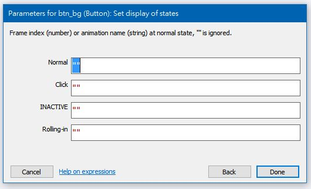

# [Construct 2] 按鈕製作  
難度：初級 
使用插件：rex＜Button＞、rex＜Touch wrap＞

在製作遊戲UI時，我們常常需要用到按鈕。可是Construct 2自帶的按鈕不夠美觀，該怎麼辦呢？ 
針對這個問題，rexrainbow特別製作了好用的rexrainbow版＜Button＞插件，現在就讓我們來試試吧！

## １．首先，為專案添增以下物件：   
|插件|命名|说明| 
|-|-|-|  
|Sprite|picture|圖片一張|  
|Sprite|btn_bg|按鈕背景|  
|BBcodetext|btn_text|按鈕文字|  
|TouchWrap|預設–|Button插件之必須|  
## ２．為物件添增動作(behavior)：
|插件|命名|说明| 
|-|-|-| 
|btn_bg|rex＜Button＞|讓物件變為按鈕|    
## ３．為物件添增特效(effect)：
|插件|命名|说明| 
|-|-|-|   
|btn_bg|＜Adjust HSL＞|改變物件顯示的HSL值|   
## ４．撰寫事件表  
  
## ５．原理解說 
rexrainbow＜Button＞（以下簡稱＜Button＞）可以非常方便地偵測出按鈕的狀態。

首先當玩家按下按鈕時，視為按下＜detectiong start＞會觸發。
若玩家保持按住按鈕，在不方開情況下將手指滑離按鈕，則視為取消。此時＜click cancel＞被觸發。
若玩家按住按鈕後，手指在按鈕範圍內鬆手，則視為成功點擊。此時＜clicked＞被觸發。

再來看到事件表中動作，我們在＜btn_bg＞被按下時，將HSL的#0個參數（也就是Hue色相）設為3，並且讓圖片消失。其他操作狀況下則將以上變動復原。如此即可做出一個色彩變動的按鈕了。
   
  
***  
***
如果你不想用特效來做按壓效果，也可以使用點陣圖（Bitmap）來製作。使用＜Button＞的＜Set display of states＞即可設置對應按鈕狀態的動畫   

  ***  
  *** 
  
|参数|说明|  
|-|-|  
|Normal|按鈕無動靜時之動畫|  
|Click|按鈕按住時之動畫|  
|Inactive|按鈕失能時之動畫|  
|Rolling-in|滑鼠滑到按鈕上方時之動畫|

 