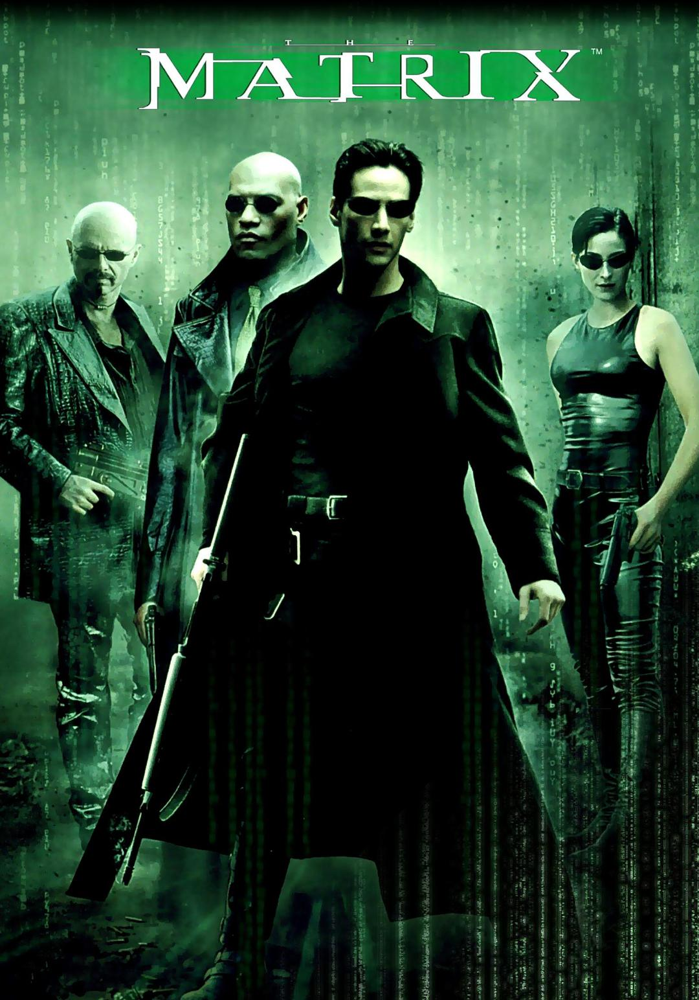

# 与IT有关的六部电影，你看过多少？  
## 1、代码奔腾 Code Rush (2000)
类型: 纪录片  
制片国家/地区: 美国  
语言: 英语  
上映日期: 2000-04-25  
片长: 59分钟  
豆瓣评分：8.4  
当年硅谷的浏览器先锋网景（Netscape）的工程师的故事。在这部纪录片中，你还可以看到两件历史性大事的第一手画面。1998年3月31日，  Netscape宣布将Netscape Communicator浏览器开源，这个新项目就叫做Mozilla。1998年11月24日，由于股价不断创出新低，Netscape公司在绝望之中把自己以42亿美元的价格卖给了AOL。  

## 2、社交网络 The Social Network (2010)
导演: 大卫•芬奇  
编剧: 艾伦•索金 / 本•麦兹里奇  
主演: 杰西•艾森伯格 / 安德鲁•加菲尔德 / 贾斯汀•汀布莱克 / 鲁妮•玛拉 / 约瑟夫•梅泽罗 / 艾米•汉莫 / Bryan Barter / Dustin Fitzsimons / Patrick Mapel / 布兰达•宋  
类型: 剧情 / 传记  
制片国家/地区: 美国  
上映日期: 2010-10-01  
片长: 120 分钟 / USA: 121 分钟  
又名: 社群网战(台) / Facebook的故事 / 脸书狂潮 / 社交网站   
豆瓣评分：8.1   
剧情简介：   
　　2003年秋，哈佛大学。恃才放旷的天才学生马克•扎克伯格（Jesse Eisenberg 饰）被女友甩掉，愤怒之际，马克利用黑客手段入侵了学校的系统，盗取了校内所有漂亮女生的资料，并制作名为“Facemash”的网站供同学们对辣妹评分。他的举动引起了轰动，一度致令哈佛服 务器几近崩溃，马克因此遭到校方的惩罚。正所谓因祸得福，马克的举动引起了温克莱沃斯兄弟的注意，他们邀请马克加入团队，共同建立一个社交网站。与此同时，马克也建立了日后名声大噪的“Facebook”。  
　　经过一番努力，Facebook的名气越来越大，马克的财富与日俱增。然而各种麻烦与是非接踵而来，昔日的好友也反目成仇……    

## 3、代码 The Code (2001)
导演: Hannu Puttonen  
主演: Linus Torvalds / Eric Raymond / Richard M. Stallman / David S. Miller / Alan Cox  
类型: 纪录片  
制片国家/地区: 芬兰 / 法国  
语言: 英语  
上映日期: 2002-01-09  
片长: 58 分钟  
豆瓣评分：7.8  
剧情简介：   
　　1991年，年仅20岁的Linus Torvalds，芬兰赫尔辛基大学的学生在网络新闻组里发布了一帖，要求大家给他既将要编写的操作系统一些建议，使他编写出更好的操作系统。他把这个项目作为一个爱好，他说，它不会成为“专业的”。但是10过去了，他与遍布世界的骇客们完成了一个叫做Linux的操作系统，其可与Windows2000竞争服务器市场，现在正在进军桌面市场。Linux为什么与众不同，是如何向传统软件企业发起挑战。每个用户都可以自由修改软件，使其适合自己使用。  
　　这部纪录片由芬兰电视台制作，后经giFT（Linux上的p2p网络）流入网络。  
　　此片较另一部Linux为主题的纪录片-《操作系统的革命》，更全面客观，《操作系统的革命》没能对开源运动中的许多重要问题进行深入的讨论，也没能很好的介绍开源项目的发展和开发过程。  
　　此片的看点有：Linus家庭的采访，拍摄到了Linus曾经开发Linux的地方，通过讲述Linux开发的历史，讲解开源社区的开发过程，对“开源软件”与“自由软件”进行对比和讨论。Linux商业化的方法。有趣的是Linus片中承认自己是社会主义者。开源软件在第三世界的发展。还有商业化后对开源社区的影响。    

## 4、硅谷传奇 Pirates of Silicon Valley
导演: Martyn Burke  
编剧: Martyn Burke / Michael Swaine / Paul Freiberger  
主演: Bodhi Elfman / Anthony Michael Hall / Noah Wyle  
类型: 剧情 / 传记  
制片国家/地区: 美国  
语言: 英语上映日期: 1999-06-20(美国)  
片长: 95分钟  
又名: 硅谷有贼 / 硅谷海盗 / 微软英雄  
豆瓣评分：7.4  
剧情简介：  
　　个人电脑在现代人的日常生活中日渐不可或缺，但有多少人知道世界最大的电脑公司〃苹果〃和〃微软〃当初是如何崛起的？本片就要带观众一窥其中的秘辛。诺亚怀尔（电视影集「急诊室的春天」）与乔伊斯洛尼克（「龙卷风」）饰演苹果电脑的创建人史提夫贾伯斯和史提夫沃兹涅克，安东尼麦可霍尔（「剪刀手爱德华」）和约翰狄马乔（电视影集「法网游龙」）则饰演建立微软电脑王国的比尔盖兹和史提夫鲍莫，这四个充满远见的年轻人，晚上在宿舍内绞尽脑汁、苦思良策，白天则在校内进行你来我往的斗智，展开一场延烧至今、改变了整个世界的全球电脑大对决。本地片商虽将本片取名为「微软英雄」，但故事内容其实是以苹果电脑的总裁史提夫贾伯斯为主轴，微软电脑的比尔盖兹在片中只能算是第二男主角，而且还是个奸诈邪恶的大反派。  
   
## 5、Welcome to Macintosh (2008)
导演: Robert Baca / Josh Rizzo  
类型: 纪录片  
制片国家/地区: 美国  
上映日期: 2008-07-26  
片长: 90 分钟 / USA: 85 分钟(approx.)  
豆瓣评分：6.8  
剧情简介：   
　　在今年的Macworld 2009上，有两部关于Mac的纪录片首次被搬上屏幕。一部是MacHEADS，另一部是Welcome to Macintosh。  
　　关于Welcome to Macintosh，它由Josh Rizzo 和 Rob Baca制作，忠实的记录了苹果和Mac的一些历史轶事，由一系列人物访谈组成。
　　该纪录片公映后反响强烈，人们对此进行了有趣的讨论。电影涉及的五位人物也亲临现场并登台回答了观众的问题，他们中有苹果公司的联合创始人史蒂夫•沃兹尼克、Ron Wayne、Andy Hertzfeld。 
想成为电影中NB的程序员或者网络高手，不妨多去3w.ievents.com.cn 看看，高手都是如何炼成的~~据对震撼。  

## 6、黑客帝国 The Matrix (1999)   
导演: 莉莉·沃卓斯基 / 拉娜·沃卓斯基  
编剧: 莉莉·沃卓斯基 / 拉娜·沃卓斯基  
主演: 基努·里维斯 / 凯瑞-安·莫斯 / 劳伦斯·菲什伯恩 / 雨果·维文 / 格洛丽亚·福斯特 / 更多..  
类型: 动作 / 科幻  
制片国家/地区: 美国 / 澳大利亚  
语言: 英语  
上映日期: 1999-03-31(美国)  
片长: 136分钟  
又名: 廿二世纪杀人网络(港) / 骇客任务(台)     
黑客帝国的剧情简介 · · · · · ·   
　　不久的将来，网络黑客尼奥（基奴李维斯 饰）对这个看似正常的现实世界产生了怀疑。他结识了黑客崔妮蒂（凯莉·安·摩丝 饰），并见到了黑客组织的首领墨菲斯（劳伦斯·菲什伯恩 饰）。墨菲斯告诉他，现实世界其实是由一个名叫“母体”的计算机人工智能系统控制，人们就像他们饲养的动物，没有自由和思想，而尼奥就是能够拯救人类的救世主。   
　　可是，救赎之路从来都不会一帆风顺，到底哪里才是真实的世界？如何才能打败那些超人一样的特勤？尼奥是不是人类的希望？这是黑客的帝国，程序和代码欢迎大家的到来。  
