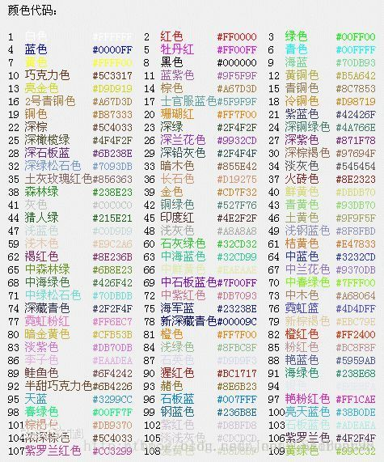
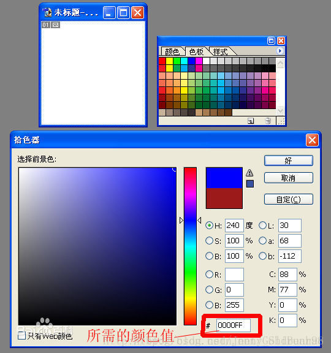

# 色彩表示与编码  
今天我们要介绍的色彩表示方式是发光体的颜色模式，又称为“加色模式”。我们都知道三原色是“红”、“绿”、“蓝”三种颜色。加色模式又称为“RGB模式”，R代表红，G代表绿，B代表蓝。  
相信大家都用在中学时代用水彩调过色，给你三支颜料，你就能配出大千世界的炫丽多彩的颜色，RGB的调色原理与我们的调色原理类似。一个黑暗的房间中，给你三个光点，0表示没光，255表示很亮，通过调节三个光电的亮度，我们就可以“配出”各式各样的颜色了。  
例如 ： 红色：R：255 G：0 B：0
## 十六进制颜色码  
  
大家肯定会疑惑，颜色后面的那一堆符号是什么。先别急，比如说蓝色 ，我们把后面的符号拆开看一下：#00 00 FF，是不是有那么一点眼熟，再想一下十六进制，是不是恍然大悟，只不过我们把这些亮度值用十六进制简化表示而已，换汤不换药。   
用画图工具的时候，必不可少的一个工具就是拾色器。  
  
  
注意到最后一栏了没有，这就是你所需颜色的RGB的hex值，原先你可能并不懂这些符号是什么意思，现在是不是有恍然大悟的感觉？如果你恍然大悟了，那恭喜你已经掌握了新的技能。  
# 其他知识  
图片中的代码，依旧是RGB色值的表示。在计算机中，RGB的每个通道，通常都以8位2进制空间来存储，因此能对每个通道进行256阶分级： 
以10进制数表示时，范围为0~255； 
以16进制数表示时，范围为0~FF。

图中 #412ed1 的表示方法，就是采用了16进制的表示： 
开头的 # ，是一个标记（这种表示常见于html及css等编码中）； 
后面的6个数码，2个2个2个分隔，依次对应R、G、B三个通道。

也就是说，#412ed1相当于 R=(hex)41, G=(hex)2e, B=(hex)d1。

(2) 
潘通，指的是Pantone，中文有时也翻译成“彩通”。提到Pantone的时候，一般是指由Pantone公司开发制定的色彩及色彩系统，它们有一套自己的编码系统，但似乎不太直观。 
// 应该是有一定规律规范的，不过我自己也不了解 : ) 
// 一般都会直接对照色卡或借助软件工具，来获取色彩对应的编码。

Pantone色，有时印刷行当的人也会笼统地称它们为“专色”。

1．颜色模式转换及采样

RGB色彩系统是我们最常用的表示颜色的方式。JPEG采用的是YCbCr色彩系统。想要用JPEG基本压缩法处理全彩色图像，得先把RGB颜色模式图像数据，转换为YCbCr颜色模式的数据。Y代表亮度，Cb和Cr则代表色度、饱和度。通过下列计算公式可完成数据转换。 Y=0.2990R+0.5870G+0.1140B Cb=-0.1687R-0.3313G+0.5000B+128 Cr=0.5000R-0.4187G-0.0813B＋128 人类的眼晴对低频的数据比对高频的数据具有更高的敏感度，事实上，人类的眼睛对亮度的改变也比对色彩的改变要敏感得多，也就是说Y成份的数据是比较重要的。既然Cb成份和Cr成份的数据比较相对不重要，就可以只取部分数据来处理。以增加压缩的比例。JPEG通常有两种采样方式：YUV411和YUV422，它们所代表的意义是Y、Cb和Cr三个成份的数据取样比例。

2.DCT变换

DCT变换的全称是离散余弦变换(Discrete Cosine Transform)，是指将一组光强数据转换成频率数据，以便得知强度变化的情形。若对高频的数据做些修饰，再转回原来形式的数据时，显然与原始数据有些差异，但是人类的眼睛却是不容易辨认出来。 压缩时，将原始图像数据分成8*8数据单元矩阵，例如亮度值的第一个矩阵内容如下： JPEG将整个亮度矩阵与色度Cb矩阵，饱和度Cr矩阵，视为一个基本单元称作MCU。每个MCU所包含的矩阵数量不得超过10个。例如，行和列采样的比例皆为4:2:2，则每个MCU将包含四个亮度矩阵，一个色度矩阵及一个饱和度矩阵。 当图像数据分成一个8*8矩阵后，还必须将每个数值减去128，然后一一代入DCT变换公式中，即可达到DCT变换的目的。图像数据值必须减去128，是因为DCT转换公式所接受的数字范围是在-128到+127之间。 DCT变换公式：

x,y代表图像数据矩阵内某个数值的坐标位置f(x,y)代表图像数据矩阵内的数个数值u,v代表DCT变换后矩阵内某个数值的坐标位置F(u,v)代表DCT变换后矩阵内的某个数值 u=0 且 v=0 c(u)c(v)=1/1.414 u>0 或 v>0 c(u)c(v)=1 经过DCT变换后的矩阵数据自然数为频率系数，这些系数以F（0，0）的值最大，称为DC，其余的63个频率系数则多半是一些接近于0的正负浮点数，一概称之为AC。

3、量化

图像数据转换为频率系数后，还得接受一项量化程序，才能进入编码阶段。量化阶段需要两个8*8矩阵数据，一个是专门处理亮度的频率系数，另一个则是针对色度的频率系数，将频率系数除以量化矩阵的值，取得与商数最近的整数，即完成量化。 当频率系数经过量化后，将频率系数由浮点数转变为整数，这才便于执行最后的编码。不过，经过量化阶段后，所有数据只保留整数近似值，也就再度损失了一些数据内容，JPEG提供的量化表如下：

4、编码

Huffman编码无专利权问题，成为JPEG最常用的编码方式，Huffman编码通常是以完整的MCU来进行的。 编码时，每个矩阵数据的DC值与63个AC值，将分别使用不同的Huffman编码表，而亮度与色度也需要不同的Huffman编码表，所以一共需要四个编码表，才能顺利地完成JPEG编码工作。 DC编码 DC是彩采用差值脉冲编码调制的差值编码法，也就是在同一个图像分量中取得每个DC值与前一个DC值的差值来编码。DC采用差值脉冲编码的主要原因是由于在连续色调的图像中，其差值多半比原值小，对差值进行编码所需的位数，会比对原值进行编码所需的位数少许多。例如差值为5，它的二进制表示值为101，如果差值为-5，则先改为正整数5，再将其二进制转换成1的补数即可。所谓1的补数，就是将每个Bit若值为0，便改成1；Bit为1，则变成0。差值5应保留的位数为3，下表即列出差值所应保留的Bit数与差值内容的对照。 在差值前端另外加入一些差值的霍夫曼码值，例如亮度差值为5（101）的位数为3，则霍夫曼码值应该是100，两者连接在一起即为100101。下列两份表格分别是亮度和色度DC差值的编码表。根据这两份表格内容，即可为DC差值加上霍夫曼码值，完成DC的编码工作。

AC编码 AC编码方式与DC略有不同，在AC编码之前，首先得将63个AC值按Zig-zag排序，即按照下图箭头所指示的顺序串联起来。

63个AC值排列好的，将AC系数转换成中间符号，中间符号表示为RRRR/SSSS，RRRR是指第非零的AC之前，其值为0的AC个数，SSSS是指AC值所需的位数，AC系数的范围与SSSS的对应关系与DC差值Bits数与差值内容对照表相似。 如果连续为0的AC个数大于15，则用15/0来表示连续的16个0，15/0称为ZRL（Zero Rum Length），而（0/0）称为EOB（Enel of Block）用来表示其后所剩余的AC系数皆等于0，以中间符号值作为索引值，从相应的AC编码表中找出适当的霍夫曼码值，再与AC值相连即可。 例如某一组亮度的中间符为5/3，AC值为4，首先以5/3为索引值，从亮度AC的Huffman编码表中找到1111111110011110霍夫曼码值，于是加上原来100（4）即是用来取[5，4]的Huffman编码1111111110011110100，[5，4]表示AC值为4的前面有5个零。 由于亮度AC，色度AC霍夫曼编码表比较长，在此省略去，有兴趣者可参阅相关书籍。 实现上述四个步骤，即完成一幅图像的JPEG压缩。
