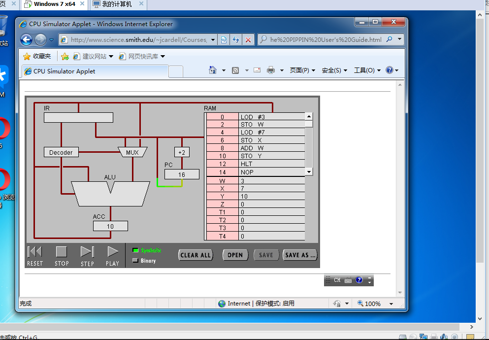
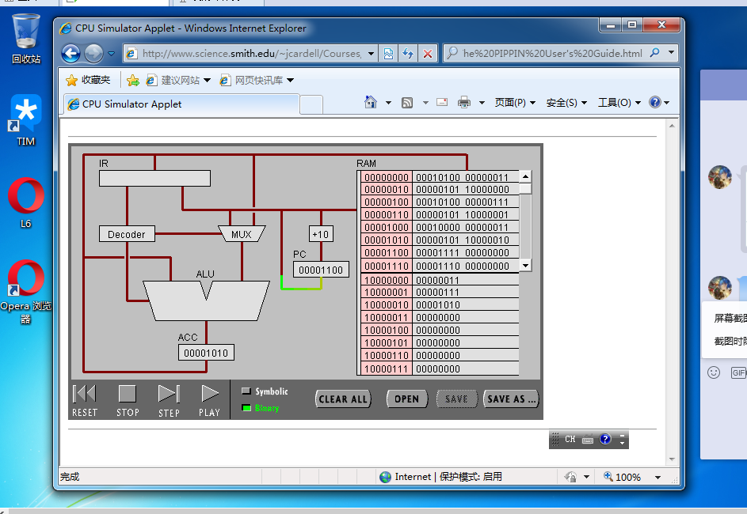
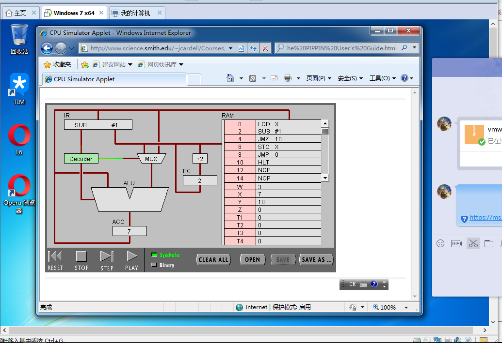
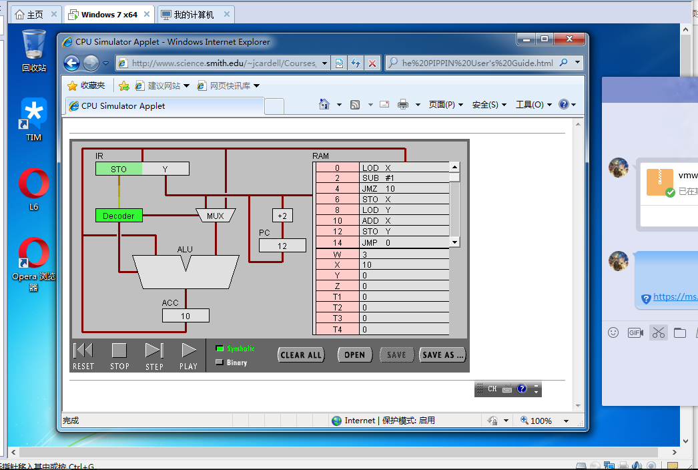

 # 机器语言实验报告
实验名称：机器语言实验  
学号：18342050  
姓名：李金敏

## 目录
一、实验目标  
二、实验步骤与结果  
三、实验小结  

### 一、实验目标
1、了解CPU的结构及各组件的作用
2、了解并初步懂得如何使用机器语言
3、了解高级语言与机器语言的转化
4、通过实验，比较得出高级语言与机器语言的区别  
### 二、实验步骤与结果 
## 任务一：简单程序   

   

### （2）点step after step。观察并回答下面问题
1.PC，IR 寄存器的作用。  

     /*在指令运行的过程中，PC中存放着正在执行的指令的地址码，计算机根据PC中的地址去RAM中进行寻址，找到相应地址中的内容，然后把它输送到指令寄存器IR中。也就是说，PC中存放着指令的地址码，并且每次操作执行完城后会对地址码进行相应的加法（具体的数值取决于指令的长度），然后这样就可以依次执行计算机中的指令；而每一次要执行的指令都会先被放到IR寄存器中，以待进一步的decode然后执行。*/

2.ACC 寄存器的全称与作用。

   /*ACC即累加器。  
     在我们计算加法的过程中，指令LOD X执行完成后，X的初始值就被保留在了ACC寄存器中。同样，当两个数加法完成之后，运算的结果同样也存放在了ACC中，然后在回到RAM中，被存储到了Z中。
     也就是说，在CPU执行某种运算前，两个操作数中的一个通常应放在累加器A中，运算完成后累加器A中便可得到运算结果。  
     这个结果可用于下一个操作。*/  

3.用“LOD #3”指令的执行过程，解释Fetch-Execute周期。

  /*输入一条LOD #3的指令，然后点击play。
   首先，PC中的地址码就是该指令的地址码，计算机按照这个地址去RAM中寻找相应的指令，并将这条指令运送到了IR中。 这一步对应着Fetch the next instruction。  
   然后，指令从IR中被转移到了Decoder中，对指令进行解码过程，判断该指令要进行何种操作，并且判断该指令中用到的操作数在哪里。（即是在指令中就含有还是要再到RAM中读取）。 这一步对应着 Decode the instruction。  
   又LOD #3中的操作数本身就在这条指令中，所以不再需要额外从内存中读取。因而不进行Get data if needed这一步。  
   最后，“3”这个数字通过数据选择器被存放到了ACC中，完成了Execute the instruction的操作。*/    

4.用“ADD W” 指令的执行过程，解释Fetch-Execute周期。  

/* 输入一条ADD W的指令，然后点击play。
   首先，PC中的地址码就是该指令的地址码，计算机按照这个地址去RAM中寻找相应的指令，并将这条指令运送到了IR中。 这一步对应着Fetch the next instruction。
   然后，指令从IR中被转移到了Decoder中，对指令进行解码过程，判断该指令要进行何种操作，并且判断该指令中用到的操作数在哪里。（即是在指令中就含有还是要再到RAM中读取）。 这一步对应着 Decode the instruction。
   又ADD W中的W的值在w的地址中，所以要到W对应的地址中去取。因进行Get data if needed这一步。
   再者，上一次的数据在ACC中然后进入ALU 和W的值相加。
   最后，“ADD w”这个数字通过数据选择器被存放到了ACC中，完成了Execute the instruction的操作。*/  

5.“LOD #3” 与 “ADD W” 指令的执行在Fetch-Execute周期级别，有什么不同。  

/*从上面的分析我们很容易看出来，这两条指令的执行在获取数据的一步有明显的不同，因为“LOD #3” 的指令经过译码后，计算机知道这条指令的操作数就在这条指令中，而不需要再到内存中读数，但“ADD W”的指令就不同了，计算机只能在这条指令中读到“W”的地址码，并不能得到其具体数值，因而还多了一步重新回内存中读取数据的过程。*/

   

### （3）点击“Binary”,观察回答下面问题

     

1.写出指令 “LOD #7” 的二进制形式，按指令结构，解释每部分的含义。  

/*00010100 00000111
第一个字节中的第四位数代表了这个指令的寻址模式，其中“1”表示操作数是数值，也就是说第二个字节表示了一个二进制数——7。第一个字节中的后四位代表了操作码，其中0100表示这是一个LOD操作。*/  

2.解释 RAM 的地址。  

/*RAM中的所有存储的数据和指令都有自己的地址，使计算机可以按照地址来读取指令和数据。在这个模拟的CPU中，可以看出来每一个指令的长度是两个字节，每一个数据的长度是一个字节，因此地址码也可以反映出存储内容的字节长度。*/  

3.该机器CPU是几位的？（按累加器的位数）  

/*8位*/  

4.写出该程序对应的 C语言表达。  

/*int main()
{
int x=3;

int y;

y=x+3;  

return 0;  
}*/

   

## 任务 2：简单循环  
### （1） 输入程序Program 2，运行并回答问题：
1.用一句话总结程序的功能  

/*计算从一加到N的程序，并输出和*/  

2.写出对应的 c 语言程序

/*
int main()
{
int w=n;
int sum=0;
int i=0;

for(i=0;i<=w;i++) {
	sum+=i;
}
return 0;
}  
*/

   

### （2） 修改该程序，用机器语言实现 10+9+8+..1 ，输出结果存放于内存 Y
1.写出 c 语言的计算过程  

/*  
    
    int main()    

    int w=10;

	int sum=0;

	int i=0;

	for(i=0;i<=w;i++){

	sum+=i;

	}

     return 0;

    }
*/  

2.写出机器语言的计算过程  

/*
 LOD #0  
 STO Y     
 LOD #10   
 STO X  
 ADD Y  
 STO Y   
 LOD X  
 SUB #1    
 JMZ 24   
 STO X     
 JMP 10  
 HLT   
*/  

3.用自己的语言，简单总结高级语言与机器语言的区别与联系。  

/*
 通过这个模拟CPU的运行，我们可以直观的感受到机器语言是一种直接面向机器的语言，也就是计算机可以明白的语言，通过各种电路等硬件设备而实现它的功能，但是太过繁琐，不便于人们记忆和掌握，虽然可以直接对电路进行操作，但是想要用这种语言来编写复杂的程序过于痛苦。简单的一个循环就会把人搞晕。
 而高级语言是建立在机器语言的基础之上的，他们的实现最终还是要依赖于机器语言来完成，通过编译等操作再将高级语言转为低级的语言从而使计算机可以执行。这种语言给人们提供了很大的便利，可以用更简单的语句来实现较为复杂的程序。
 虽然这两者看起来区别很明显，但是机器语言也是高级语言运行的基础。
*/  

### 三、实验小结  

/*本次实验让我懂得了机器语言的具体操作过程，并了解了部分机器语言的书写。*/