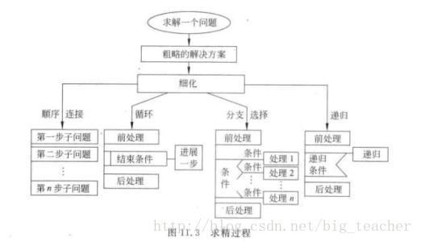
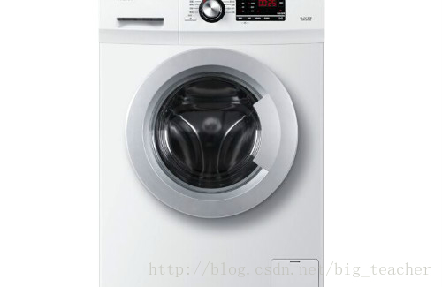

# 介绍“自顶向下，逐步求精”的编程方法
## 自顶向下，逐步求精  
  

### 概念
目前软件开发方法使用最广泛的，当属结构化的方法和面向对象的方法。  而其中，结构化程序设计支持“自顶向下, 逐步求精”的程序设计方法。

“自顶向下”的具体内涵是将复杂、大的问题划分为小问题，找出问题的关键、重点所在，然后用精确的思维定性、定量地去描述问题。   

而“逐步求精”的具体内涵是是将现实世界的问题经抽象转化为逻辑空间或求解空间的问题。  
复杂问题经抽象化处理变为相对比较简单的问题。经若干步抽象（精化）处理，最后到求解域中只是比较简单的编程问题。

### 优点：
个人认为学习并使用“自顶向下，逐步求精”的方法，也就是采用模块分解与功能抽象和分而治之的方法，可以更有效地将一个较复杂的程序系统设计任务分解成许多易于控制和处理的子程序，便于开发和维护。它的重点在于把功能进行分解，也就是说，它是面向过程的。

## 以你观察的洗衣机为案例，用伪代码描述的控制程序设计  
  

    READ 用户洗衣模式  
    READ 注水量  
    SET water to 0 
    FUNCTION wateropen(注水量)  
    { 
    WHILE (water < 注水量)  
    {  
    注水  
    Water 计水  
    } 
    } 
    FUNCTION dip(用户洗衣模式) 
    {  
    IF(用户洗衣模式==浸泡){  
    SET timer to 0  
    WHILE (timer < 浸泡时间)  
    {  
    停止运行  
    Timer 计时  
    }  
    }

    }  
    开始洗衣 
    FUNCTION begin(洗衣时间)  
    { 
    SET timer to 0  
    WHILE(timer < 洗衣时间)  
    {  
    滚筒左三次右三次  
    Timer 计时  
    } 
    } 
    FUNCTION waterout(水量)  
    { 
    WHILE(water > 0)  
    {  
    排水  
    Water 计水  
    } 
    } 
    FUNCTION dry(脱水时间)  
    { 
    SET timer to 0  
    WHILE(timer＜脱水时间)  
    {  
    脱水  
    Timer 计时  
    } 
    }  
