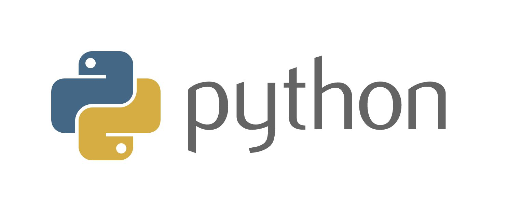
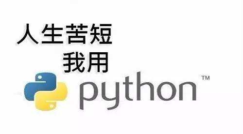
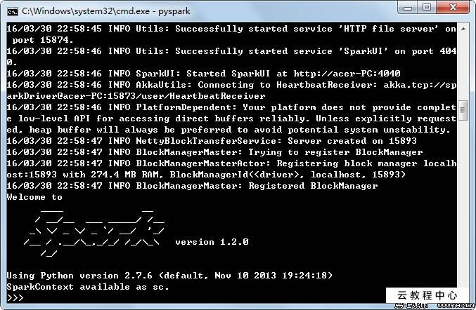
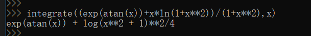
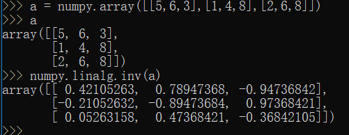
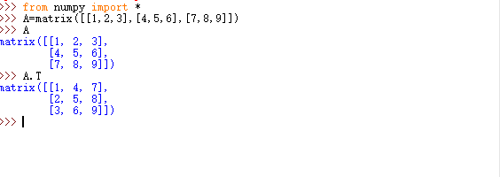
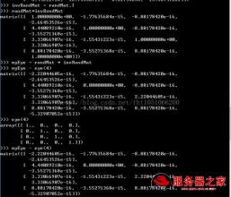

# 使用python解数学题 实验报告  

## 一、实验目的  
### 1.了解一种“解释型”语言 python
### 2.使用 python 做一些简单的高数与线代题目计算

## 二、实验环境要求  

1.编程工具：Python（winpython / Anaconda）  
2.操作系统：Windows (only)

## 三、实验过程  
### 3.1 高数
#### （1）定积分  

#### （2）不定积分

### 3.2 线代  
#### （1） 求矩阵的逆

#### （2）求矩阵的转置

## 四、实验总结 

python 是拥有世界上最庞大的函数库（程序库）的语言。这归功于 Python 是最早开源的项目，众多大学非计算机/计算机专业使用 python 作为科学计算工具。得益于开放和巨大且日益增长的程序库，今天从数学函数、到web编程、网络分析、数据挖掘、机器学习、生物信息处理、图形图像、大数据处理等等，python 都是最重要、最方便的开发语言。