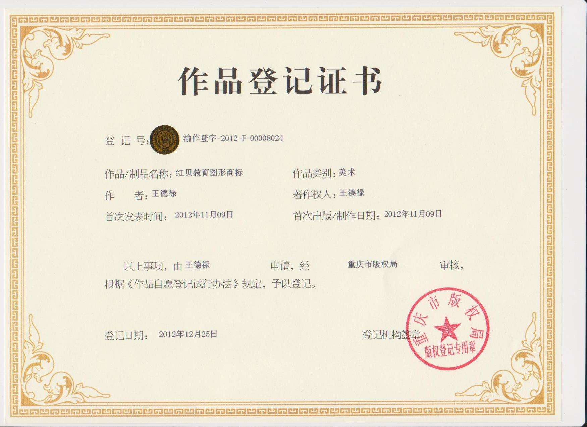
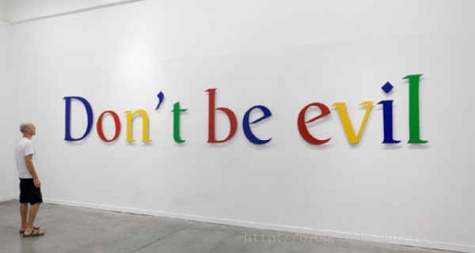
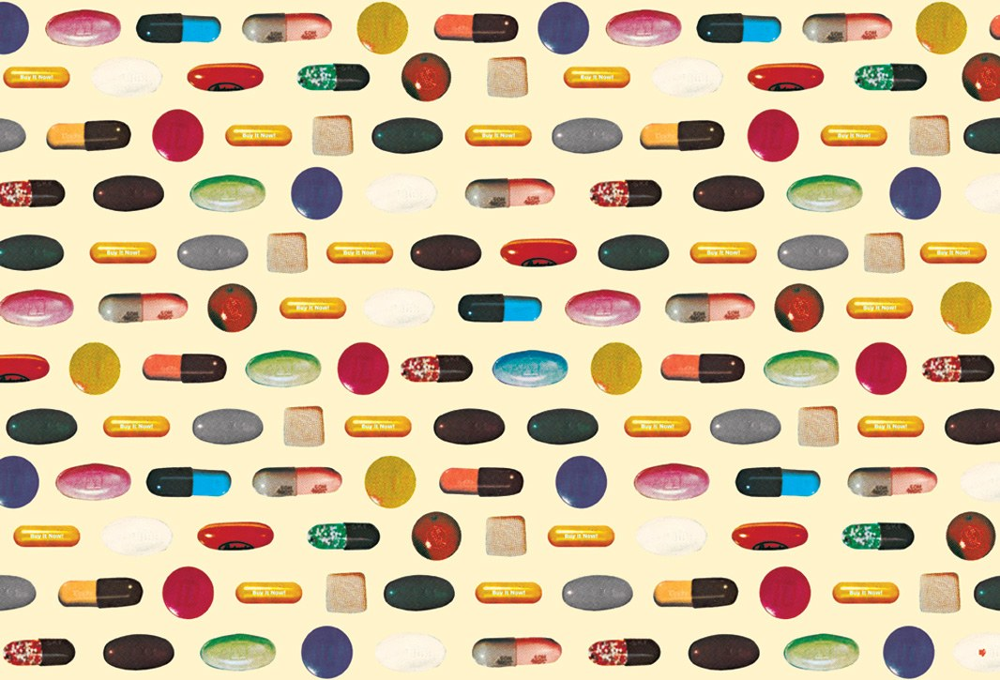
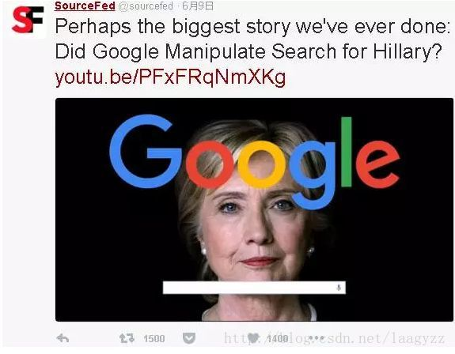
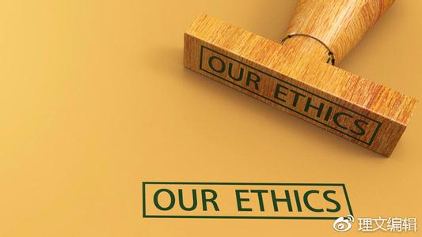

# IT行业伦理与道德研究

## 序言   
随着互联网、移动应用的飞速发展，用户数据史无前例的被集中，用户数据的价值得到广泛的认可！互联网企业凭借自己掌握的数据与应用资源，由于信息不对称，一些企业通过一些技术拥有了支配社会资源，影响社会生活的能力。“能力越大，社会责任愈大”成为社会的共识！谷歌很早就认识到自己在这场变革中的地位和作用，提出了“不作恶（don’t be evil）”的座右铭。   

在中国，基于互联网的各种创新，为中国创新型企业提供了“弯道超车”，在世界舞台上表现的机会。这场创新的大潮之中，法律远远滞后于社会的变革。  

   

中国是一个没有版权意识的国家。一个没有版权意识的国度，山寨盗版当然再正常不过了。一群搞科研搞创作的如果仅仅以山寨盗版手段就能活的很滋润，那他们又何必花大代价自己研发创作呢？这个以眼前利益为主导思想的中国IT行业，在未来注定完全丧失国际市场的竞争能力。3个大学生分16.5亿美元的神话永远不会在中国这片没有知识产权的土地上出现。

## 第一章 伦理与道德的含义  

     
基本解释： 

①事物的条理：乐者，通伦理者也。也指有条理地安排部署：族大费广，生事未成，伦理颇亦劳心。 

②中国古代原指音乐的条理。后用来比喻封建社会父子、君臣、夫妇、长幼、朋友各类等级尊卑关系及其相应的道德规范。其义与人伦一词相同。“伦理”与“道德”一词有时通用，如“伦理关系”即“道德关系”。  

  

## 第二章 透过现象看本质  
### 谷歌网的一些伦理风险行为  

  
1.为假药打广告  
     
  
        /*谷歌的广告部门为了利润，主动帮助卖假药者规避其公司的合规审查，使得大量假药、走私处方药、非法药物（如类固醇）广告网页长时间充斥其搜索结果。本案由FBI调查，于几年前和解，谷歌被罚款5亿美元。 */  

      

2.搜集泄露用户隐私    

    /* 作为一家数据公司，谷歌在对用户隐私数据的获得和处理问题上也遭到许多质疑。
    德国监管当局对Google的街景拍摄车的审计迫使这个信息巨人承认他们的雇员“不小心”（accidentally）在30个国家驱车通过那些未加密的 wifi网络时抓取了大约600G的个 人数据（大约3年时间），“这些街景拍摄车的天线收集的数据包括：电子邮件的片段、文字和图片，甚至某人正在访问什么网站”(每 日电讯报道)。
 */

   
  
3.收买教授撰写学术论文   

    /*就在昨天，《华尔街日报》刊登了一篇题为“收买教授：谷歌的学术影响力运动内幕”（Paying Professors: Inside Google’s Academic Influence Campaign）的深度文章。同时，反谷歌组织“谷歌透明性计划”（Google Transparency Project）也发表了一篇报告，旨在揭露这家科技巨头其实“作恶多端”：谷歌不仅收集世界上所有的信息，而且在必要时，会去主动影响这些信息！通过与学者们的暗中交易，谷歌会发挥其在学术界的影响力，使相关政策法规制定朝有利于自身的方向发展。
*/  

   

4.干预政治    

    /* 名为SourceFed的独立媒体6月9日爆料称，将“Donotbeevil（不作恶）”作为口号的谷歌涉嫌与美国民主党总统候选人希拉里·克林顿（HillaryClinton）的政党、财团勾结，操纵搜索结果，让人们只看得到她的正面报道。 */    

   

## 第三章  总结
  
   
当然，我们还是要以一个冷静客观的心态看待这些报道，不能仅仅因为这些事情就认为谷歌原来是一个十恶不赦的公司，毕竟报道也可能出偏差，事情的真相也许还有待进一步被揭露。  

互联网的迅速发展，导致许多法律难以涉及的问题，使得类似 wephone 这样运行在“灰色”地带的产品非常多。 当年的“支付宝”、“滴滴租车” 等等都有一段时间处于“灰色”状态，是否能成长壮大很大程度取决了社会的认可，因而“创业者”或企业家的社会责任意识是关键。 在超前的创新和滞后的法律之间，维系社会均衡的就是人们的“良知”。无论是百度、还是携程，失去了道德与伦理就应该算受到了社会合理的惩罚。
  
  

## 附录  
参考文献：  
百度知道  
百度百科  
新华词条  
百度图片  
软导课件  
百度网页

