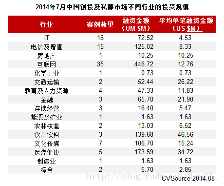

# 中国IT风投之我见  
## 概念

风险投资（Venture Capital）简称是VC，在中国是一个约定俗成的具有特定内涵的概念，其实把它翻译成创业投资更为妥当。广义的风险投资泛指一切具有高风险、高潜在收益的投资；狭义的风险投资是指以高新技术为基础，生产与经营技术密集型产品的投资。根据美国全美风险投资协会的定义，风险投资是由职业金融家投入到新兴的、迅速发展的、具有巨大竞争潜力的企业中一种权益资本。   

从投资行为的角度来讲，风险投资是把资本投向蕴藏着失败风险的高新技术及其产品的研究开发领域，旨在促使高新技术成果尽快商品化、产业化，以取得高资本收益的一种投资过程。从运作方式来看，是指由专业化人才管理下的投资中介向特别具有潜能的高新技术企业投入风险资本的过程，也是协调风险投资家、技术专家、投资者的关系，利益共享，风险共担的一种投资方式。   
## 起源

“风险投资”这一词语及其行为，通常认为起源于美国，是20世纪六七十年代后，一些愿意以高风险换取高回报的投资人发明的，这种投资方式与以往抵押贷款的方式有本质上的不同。风险投资不需要抵押，也不需要偿还。如果投资成功，投资人将获得几倍、几十倍甚至上百倍的回报；如果失败，投进去的钱就算打水漂了。对创业者来讲，使用风险投资创业的最大好处在于即使失败，也不会背上债务。这样就使得年轻人创业成为可能。总的来讲，这几十年来，这种投资方式发展得非常成功。  

  

## 在中国的发展  

从1985年我国中央政府颁布有关发展投资风险行业的政策开始，随着国家综合实力的强化，风险投资在我国从萌芽阶段逐步发展，经历了20多年的发展时间,已经获得了较大的进步。尤其是从2004年发展至今，国内经济市场的进一步发展推动了业的高速发展。   
作为金融市场的重要组成部分，风险投资的发展历程从侧面反映了我国金融市场的发展情况与波动趋势。   
(一)政治环境。现阶段，我国中央政府逐渐解决了风险投资行业的合法性问题与税收优惠制度的导向问题;并将投资风险与我国资本市场视为社会发展高新科技的重要途径。  

 

(二)投资风险组织结构。目前,我国投资风险组织结构主要有:国有独资型风险投资组织、国内企业建立的公司型机构、政府参股型风险组织、外商独资或合资型风险组织这四种类型。根据调查发现，中资型风险投资机构数量上占据一定的优势，但是外资型风险投资组织的平均资本量却比中资型机构多得多。   
(三)风险投资企业的发展规模和投资对象。我国市场的风险投资项目、投资总金额量、单笔项目的投资金额逐年呈上涨趋势，其中2011年风险投资项目是362笔,投资总金额量63亿美元。我国风险投资的资金分布具备较强区域性和集中性特征，其中主要分布在广东、北京、福建、上海、江苏等经济发展较快的一级型城市与东部的沿海地区等。此外,近几年来,还处于起步阶段的初创型企业的风险投资数量在不断增加。  

   

## 风投的宠儿——IT

为什么风投喜欢IT行业？很简单，因为更容易获利。论创新性与颠覆性，IT行业有着其他行业无法比拟的优势，也许只是一点小小的改变和机遇就能给这个时代带来革命，从而财源不断。这样就符合了风投高回报的特点。   
在1998年的第一波投资热潮中，几乎所有的风投都向互联网领域涌进，成就了一批优秀的网络公司；而在2005～2007年的第二波投资热中，风投们又将目光转向SNS、电子商务等互联网的细分领域。统计数据显示，在1999～2008年的10年期间，广义IT行业平均以53％的比例占据了国内风投市场的大半壁江山。 

因此，在李开复“创新工场”8亿元人民币大手笔下注的背后，IT行业职业经理人转行做风投的大趋势，比他的创业计划更值得深思，联想的马雪征、金山的雷军和展讯的陈大同等人都已开始投资人的生涯。   
IT从业者转向投资行业在国外并不鲜见。今年8月，Facebook前CFO吉迪恩。余以普通合伙人身份加入风险投资公司KhoslaVentures.在此之前，他曾先后担任雅虎财务高级副总裁、YouTube网站CFO以及风险投资公司红杉资本的合伙人。   
更为著名的是，IBM前主席兼首席执行官郭士纳退休后成了凯雷集团的董事长，该集团是被华尔街称为“总统俱乐部”的全球最大私人股权投资基金之一。此后，华尔街的商业精英纷纷步其后尘。  
国内延续了华尔街的“转会潮”。2008年初，事业成败皆拜小灵通所赐的UT斯达康原总裁吴鹰宣布复出并加盟和利投资集团，任该集团的资深合伙人。他当时曾表示：“能把我以前的经验和资源整合在一起，同时把自己的一些教训跟企业家分享，如果能帮助这个企业做大做好，是非常有意思的事情。”创办了亚信和网通的田溯宁在离开网通之后，以中国宽带基金为平台做起了私募。   

2002年就开始考虑投资的柳传志在提到自己转行的原因时说，“我想做的事情就是在退出联想的管理一线以后，继续培养人，通过我选的人把联想的基础管理思想，特别是建班子、定战略、带队伍‘三要素’传承下去。做投资是体现这种价值最好的一种方式。”成为投资人以后，回报变成“基金管理费＋分红”的形式让他感到新鲜。   
另外，和做实业不同的是，“做投资以后，知识和眼界可能就要更宽一点，必须对更多的行业有了解，对地域要有了解，甚至对世界的政治经济的大气候都要了解。”柳传志说。    

