# 互联网时代的盈利模式
## ————吴军浪潮之巅"流量流量流量”  

###   美国电话电报公司（AT&T）

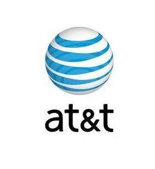  

AT&T公司是由电话之父亚历山大.贝尔创立于1877年，最初叫贝尔电话公司，实现了人类第一次远程试试的交互通信。1925年，成立了贝尔实验室，是历史上最大、最成功的私人实验室，AT&T公司为其提供丰厚的经费，使得贝尔实验室在通信领域长期执牛耳，闻名于世的发明有晶体管、数字交换机、unix系统和C语言等。1984年，根据联邦反垄断法，AT&T的市话业务被分成8家小公司，而AT&T公司从事长途电话和通信设备的制造。1995年，AT&T又将自己分为三个部分：从事电信部分的AT&T,从事设备制造业务的朗讯，从事计算机业务的NCR。1996年朗讯上市，是当时历史上最大的上市行动。这次拆分是AT&T衰落的开始。2000年时，为了达到华尔街的期望并给投资人带来盈利，朗讯将自己的无线设备部门分出去单独上市，AT&T把自己拆分成AT&T（企业服务和个人业务）、AT&T移动、AT&T宽带。随着科技的进步，互联网对传统的电话业务造成了很大的冲击，AT&T和朗讯逐渐没落，2006年两家苦苦挣扎的阿尔法特和朗讯宣布合并，成立新的阿尔法特-朗讯公司，贝尔实验室也因经费不足被迫关掉，2015年诺基亚提出收购阿郎，预计2016年完成。AT&T被SBC收购，而SBC正是1984年AT&T分出去8家小公司中最小的一家。原来的AT&T  

 公司从此消亡。
### 蓝色巨人IBM

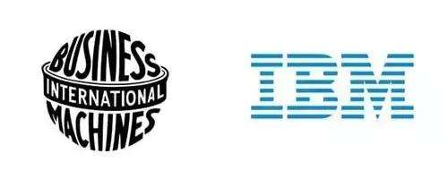  

IBM 的图标是蓝色的，1996年，它研发的超级计算机深蓝首次在国际象棋中战胜了人类的世界冠军，所以被称为蓝色巨人。IBM是为数不多成功逃过历次经济危机的公司。1924年，老沃森控股原制表公司，改名IBM。二战期间，以制造精密器械见长的IBM还参与枪械的制造。二战以后，1952年，主张发展新兴电子工业的小沃森成为IBM新总裁，IBM从此开始领导电子技术革命的浪潮。提起电子计算机，和IBM是分不开的，冯.诺依曼的系统架构也是在此时提出的，冯.诺依曼后来成为了小沃森的顾问。小沃森将计算机从政府部门和军方推广到民间，将它的功能从科学计算变成商用，小沃森执掌IBM的20年间，IBM的平均年增长率高达30%。1971年小沃森退休，之后
 的20年IBM在PC上的竞争不是很顺利，由于美国反垄断法的存在以及诸多原因，IBM在PC的发展不如微软和苹果，并且由于摩尔定律，个人电脑的性能每隔18个月就会翻一番，慢慢开始胜任一些以前只有大型机才能做的工作，这样，个人电脑开始危机到大型机的市场，IBM 出现严重亏损。1993年，郭士纳临危受命，出任IBM首席执行官。领导IBM从一家计算机硬件制造公司成功转型为以服务和软件为核心的服务型公司。为了提高利润，IBM不断淘汰不挣钱或挣钱少的业务，2004年，IBM把PC业务卖给了中国的联想公司，2014年，IBM又把x86服务器业务卖给了联想，为转型云计算做准备。第一次交易是中国公司首次收购美国著名公司的业务。  

### 乔帮主的苹果公司  

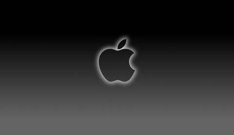  

苹果公司是大家比较熟悉的公司，它的PC、PAD、iphone以高端用户著称。1976年，21岁的乔布斯在车库里办起了苹果公司，1984年图形界面电脑麦金托什诞生，是世界上第一款普通老百姓能买得起的带图形界面的并使用鼠标的个人电脑。1985年，乔布斯被股东们赶出了自己创建的公司，苹果公司进入了长达15年的低谷期。1997年，乔布斯又被请回来执掌“船底有个大洞的船”，1998年iMac诞生，苹果重新盈利。2001年苹果公司推出了ipod音乐播放器，仅一年ipod的营业额占公司收入的15%。2003年乔布斯患上癌症（可以通过手术治愈）。2001-2010年时美国多灾多难的一年，首先是2001-2002年时互联网泡沫破灭引起的危机，后一次是2007-2009年房地产次贷危机引起的历史上第二大金融危机。2007年iphone诞生（iphone4），颠覆了整个手机行业。2010年ipad诞生，同年苹果的市值再次超过微软。2011年，乔布斯去世，蒂姆.库克担任苹果CEO，同年苹果市值超过埃克森美孚石油公司，成为全球市值最高的公司。2015年，苹果推出智能手表apple
 watch。  

###  英特尔公司—奔腾的芯  

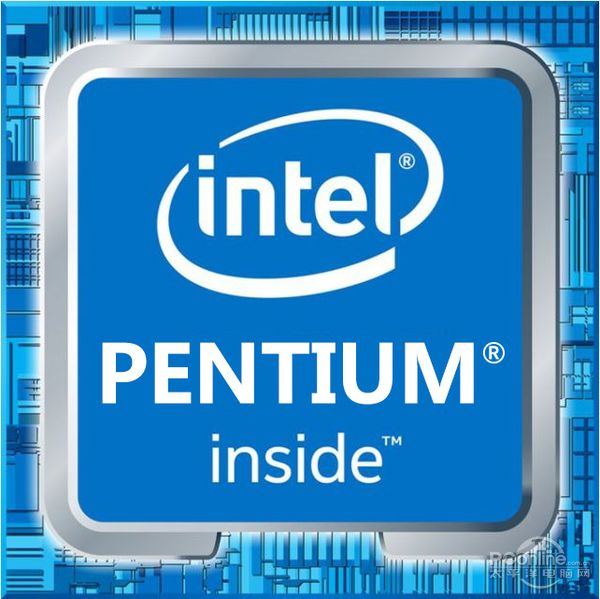  

硅谷之所以叫硅谷，并不是因为它盛产硅，而是因为硅谷有很多使用硅的半导体公司，包括全球最大的半导体公司英特尔，全世界80%的计算机处理器都是用英特尔的中央处理器。1968年戈登.摩尔在硅谷创办了英特尔公司，此前摩尔和诺伊斯在1956年还和另外6个人创办了仙童半导体公司，这8个人被成为“八叛徒”（曾经投奔离开比尔实验室的肖克利，后又离开，肖克利是天才科学家，却缺乏经营能力，雄心勃勃却对管理一窍不通）。同IBM、DEC、惠普等公司相比，英特尔很长一段时间只能算小公司，因为上世纪80年代以前，几乎所有的计算机公司都采用自己设计的中央处理器，这些计算机公司代表了处理器和制造的最高水平，而英特尔生产的处理器只能用来补充低端市场。1981年IBM高出PC后，懒得自己设计处理器，就拿英特尔的8086处理器直接用上了，结果，英特尔一举成名，其他PC厂商为了和IBM兼容，处理器都是用英特尔的。当时摩托罗拉的68020处理器在性能上优于英特尔的80386，但是由于前者完全还是五六十年代的传统公司，员工的归属性不强（没采用期权制），CEO水平相差甚远，专注性不强等原因导致了在处理器领域落败与Intel。  

###  微软—IT领域的罗马帝国  

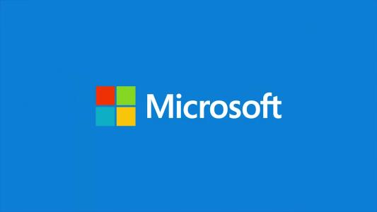  

1975年，哈弗大学大二的学生比尔盖茨退学和艾伦创立了微软公司，1980年微软为IBM提供DOS操作系统，1990年微软退出图形界面Windows3.0，微软帝国开始形成。接下来几年，微软凭借操作系统的优势，先后挤跨了莲花公司、网景公司。2000年微软成为全球市值最高的公司，同年美国华盛顿地方法院裁定微软的垄断行为，要求微软拆分成两家独立的公司。2004年，微软进入搜索领域，开始于Google展开竞争。2007年推出Windows Vista操作系统，该系统很糟糕，以至于用户宁愿使用早起的xp系统。2013年，微软收购诺基亚的手机部门，几乎全额亏损。  

### 甲骨文公司  

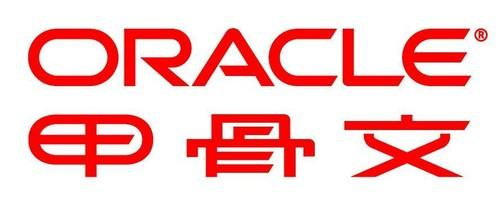  

1977年，33岁的埃里森和两个同事一起创办了数据库公司，埃里森比乔布斯大11岁，两人有着类似的个性和经历，都是由养父母抚养大，天性孤傲惺惺相惜。1984年，甲骨文从红杉资本拿到投资，两年后上市。刚开始的甲骨文是家纯软件公司，只做关系型数据库，只卖软件，而不是靠收取服务费生存。当时计算机行业没有明确的分工，软件的价值需要硬件的销售和服务来体现，如IBM的商业模式。位居计算机行业第二档（除了IBM）的公司乐意接受这样的分工，如DEC、惠普等。到了八十年代中期，计算机产业终于出现了软硬件分离的格局，甲骨文起到了很重要的作用。2000年，甲骨文和IBM、微软在数据库市场上基本三足鼎立。2005年甲骨文在数据库市场的份额首次超过IBM和微软的总和。2010年甲骨文完成对太阳公司的并购（sun公司在2008年收购了MySQL），从此甲骨文有了自己的服务器SPARC。2011年甲骨文开始大量收购基于云计算的企业级软件和服务公司，并高调进入云计算领域。2014年埃里森辞去CEO一职。  

###  思科公司—互联网的金门大桥  

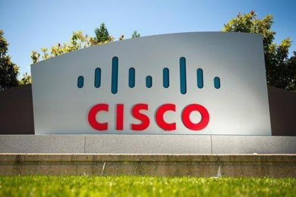  

1984年波萨卡和勒纳夫妇创立了思科公司，1986年推出第一款多协议路由产品，1990年思科公司上市，1995年钱伯斯担任思科CEO，开创了思科王国。钱伯斯采用一种宽容内部创业的政策，基本垄断了互联网路由器和其他重要设备的技术。2000年思科发展达到高潮，市值一度超过微软，成为全球价值最高的公司。2001年随着互联网泡沫的破裂，业绩急速下滑，股价下跌80%。2011年思科业绩长期停滞，思科开始大规模裁员。每个公司都逃不脱诺威格的宿命，思科已经占据了50%以上的市场，很难使公司的业绩翻倍，必须寻找新的增长点，否则会成为下一个朗讯。2015年钱伯斯辞去CEO职位，同年华为在销售额上首次超过思科，成为全球最大的电信设备公司。  

### 雅虎公司  

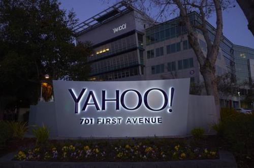  

两个对互联网贡献最大的人杨致远和费罗，对世界的贡献不止是创立了世界上最大的互联网门户网站雅虎，更重要的是制定了互联网这个行业的游戏规则—开放、免费和盈利。1995年两人成立了雅虎公司，期初是他们在斯坦福校园开发的一个软件，方便网站的分类整理和查询。互联网用户发现通过雅虎可以找到自己想要的网站或有用的信息，这样大家上网时会先访问雅虎，再从雅虎跳到其他网站。1996年仅成立一年的雅虎上市，一时间很多互联网公司纷纷效仿，中国的三大门户网站搜狐、网易、新浪也成立了。1994-2000年是互联网的大航海时代，各类网站相继出现，互联网上的内容成几何级数增长，人类进入信息爆炸时代。  

###  惠普公司  

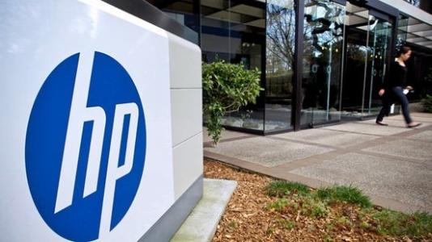  

1939年惠普成立，是第一批进驻硅谷产业园的公司之一，1957年上市，1966年进入计算机市场，成为IBM以外的7家小计算机公司之一，1984年进入打印机市场，直到1999年惠普的产品线涉及科学仪器、医疗仪器、计算机及外设。同年，卡莉.菲奥莉娜成为惠普历史上第一位女性CEO，把制造仪器部门剥离上市，成为独立的安捷伦公司。2002年收购康柏公司。2005年卡莉.菲奥莉娜离职，由马克.赫德接掌惠普，开创了5年高速发展期，2008年惠普超过ibm成为全球营业额最高的it公司。2015年，惠普将企业级的软件和IT服务业务拆分成惠普企业，单独上市。  

### 摩托罗拉—没落的贵族  

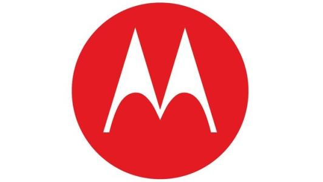  

创立于1928年，原名叫高尔文制造公司，最早是生产汽车收音机的，Motor表示汽车，ola是很多商品名常用的后缀，如Coca Cola。1940年摩托罗拉研制出真正用于战场的步话机。摩托罗拉是世界无线通信的先驱和领导者，但是它只领导了移动通信的第一波浪潮，就被对手赶超。1999年牵头了世界科技史上最了不起、最可惜的项目—铱星计划。2011年摩托罗拉分成了摩托罗拉移动和摩托罗拉解决方案两个独立上市公司，同年Google收购了摩托罗拉移动。2014年Google又将摩托罗拉移动出售给联想。  

###  Google   

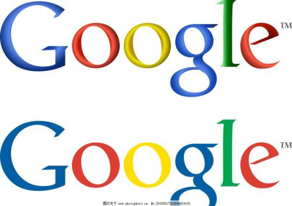 

Google是唯一一个能全方位能挑战微软的公司，20世纪90年代，互联网大潮席卷硅谷，早期的搜索引擎解决了查全率问题，但是在查准率上还没有什么突破。斯坦福大学的佩奇和布林决定在这方面做些研究，发明了pangrank算法，并由西尔弗斯坦开发出实际可用的Google搜索引擎，在搜索引擎领域迄今为止的质变只有Google取代AltaVista这一次。1998年佩奇和布林成立了Google公司，次年美国两家嘴啊的风投公司KPCB和红杉资本同时投资了Google，也是两家投资公司第一次同时投一家初创公司。2000年雅虎采用Google的搜索引擎，2002年Google占全球搜索流量的70%。2005年Google中国公司成立。2007年安卓联盟成立，2008年第一款安卓手机由HTC出厂。2012年，Google收购摩托罗拉公司，2014年又将它出售给联想。2014年，Google改名为Alphabet，Google成为它下面的一家控股公司。  

### 诺基亚  

1865年诺基亚公司成立，最初的业务是木材造纸，后来转型做过橡胶厂、电缆厂，1962年进入电子领域，1970年进入通信领域，1987年推出了移动电话，2007年诺基亚占全球手机市场的40%，达到顶峰。2008年诺基亚收购塞班系统，它一度成为全球最大的智能手机操作系统。诺基亚落伍于3G时代，2010年Android市场份额首次超过Symbian。2013年，微软宣布一79亿美元收购诺基亚的手机部门。
计算机工业的生态链
摩尔定律：计算机等IT产品的配置性能每隔18个月就会增加一倍，或者说每18个月价钱就会降一半。
安迪-比尔定律：比尔要拿走安迪所给的，比尔是微软CEO比尔盖茨，安迪是原英特尔公司的CEO安迪.格鲁夫。Intel处理器每隔18个月就会翻一番，计算机内存和硬盘的容量也会以更快的速度增长，但是微软的系统和应用软件也在越做越大，越来越慢，吃掉硬件提供的资源。这个不是微软所能控制的，因为开发人员不再像以前那样精打细算了，当年的BISIC解释器是用汇编语言编写的，精炼的不能再精炼了，但是汇编语言的工作效率极低，且写出的程序可读性很差，也无法完成越来越复杂的功能，今天，有了足够的计算机资源，工程师们更讲究开发效率、程序的规范化和可读性。常用的变成语言也从面向过程升级到面向对象，比如java比C++效率低的多，而C++又比C语言低的多。

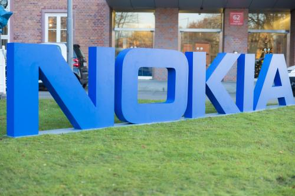 